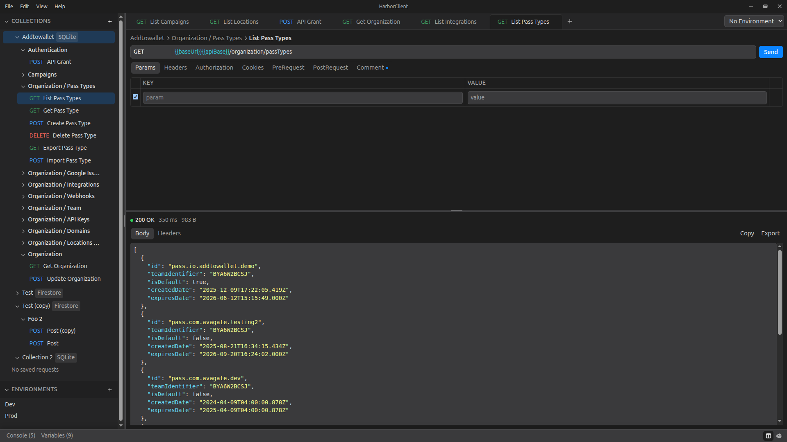

The free API client that keeps your work private: no accounts, no subscriptions, no lock-in.

**Full documentation:** [https://harborclient.com/](https://harborclient.com/)  
**Downloads:** [https://github.com/headzoo/harborclient/releases/latest](https://github.com/headzoo/harborclient/releases/latest)



## Development

```bash
pnpm install
pnpm dev
```

Use `pnpm dev -- -v` for verbose startup and diagnostic logging, or `pnpm dev -- -vv` to also log each outbound HTTP request (method, URL, request headers, and body). Response headers and response bodies are not logged.

## License

MIT

## Security

Security policy: [SECURITY.md](./SECURITY.md)
