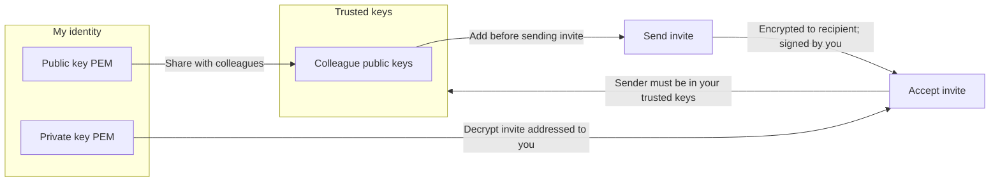

# Certificates

HarborClient uses RSA key pairs to sign and encrypt **collection invites** — the tokens you send when sharing a live remote collection with a colleague. Open **File → Certificates** to manage your identity and the public keys you trust.

This is separate from **Settings → SSL certificate verification**, which controls whether HTTP requests reject invalid TLS certificates. The keys on this page are for invite security only.

The Certificates panel has two sections: **My identity** (your key pair) and **Trusted keys** (public keys of people you trust).

## My identity

HarborClient creates a 2048-bit RSA key pair the first time you need one — for example, when you open Certificates or create an invite. Your key pair is stored locally in the application data directory as `invite-key.pem` (private) and `invite-pub.pem` (public).

Your key pair serves two roles:

- **Sign invites you send** — recipients can verify the invite came from you
- **Decrypt invites addressed to you** — only your private key can read invites encrypted to your public key

The **My identity** section shows:

| Field | Description |
| --- | --- |
| **Fingerprint** | SHA-256 hash of your public key. Use it to confirm you and a colleague are referring to the same key. |
| **Public key** | PEM-encoded RSA public key. Safe to share — colleagues need it to invite you. |

## Exporting your public key

Share your public key so collaborators can add you as a trusted recipient and encrypt invites to you.

| Action | Description |
| --- | --- |
| **Copy public key** | Copies the PEM text to the clipboard |
| **Export public key** | Opens a save dialog; default filename `invite-pub.pem` |

Send the copied text or the `.pem` file to your colleague over a channel you trust (email, chat, in person, and so on). Only share the **public** key — never your private key.

## Exporting and importing your key pair

Use these actions to back up your identity or move it to another machine.

| Action | Description |
| --- | --- |
| **Export private key** | Opens a save dialog; default filename `invite-key.pem`. **Keep this file secret** — anyone with it can sign invites as you. |
| **Import key pair** | Opens a file picker for a private-key PEM file. Replaces your local key pair with the imported one. |

Import is useful when you set up HarborClient on a new computer and want to keep the same identity, or when restoring from a backup.

::: danger
Keep your private key secret. Anyone who has it can sign collection invites as you.
:::

## Trusted keys

The **Trusted keys** section lists public keys for people you trust. Trusted keys control who can send you invites and who you can invite.

| Rule | Description |
| --- | --- |
| **Incoming invites** | HarborClient only accepts invites signed by a sender whose public key is in your trusted list. |
| **Outgoing invites** | When you create an invite, you must select a recipient from your trusted keys. The invite is encrypted so only that person can decrypt it. |

Trusted keys are stored **per machine** in the local app registry. They are not synced through shared databases — each HarborClient installation maintains its own trust list.

### Adding a trusted key

| Action | Description |
| --- | --- |
| **Add trusted key** | Enter a **Label** (for example, `Alex`) and paste the colleague's public key PEM, then click **Add trusted key**. |
| **Import from file** | Enter a label first, then click **Import from file** and select a `.pem` file containing the public key. |

Each trusted key is listed with its label and fingerprint. Click **Delete** to remove a key. After removal, invites signed by that key will no longer be accepted, and you can no longer select that person as an invite recipient.

If you try to create an invite without any trusted keys, HarborClient prompts you to add the recipient's public key under **File → Certificates → Trusted keys** first.

## Working with collaborators

Before sending or accepting collection invites, exchange public keys:

| Step | Who | Action |
| --- | --- | --- |
| 1 | You | Copy or export your public key from **My identity** and send it to your colleague |
| 2 | Colleague | Open **File → Certificates → Trusted keys**, add your public key with a label |
| 3 | Colleague | Share their public key with you |
| 4 | You | Add their public key to your trusted keys |
| 5 | Either party | Follow [Sharing collections](/collections#sharing-collections) to send or accept an invite |

When sending an invite, the sender opens the collection row menu → **Invite**, selects the recipient from the trusted-keys list, and copies the generated token. Invites expire after **seven days**.

When accepting an invite, the recipient pastes the token under **Accept invite**, then **restarts HarborClient** so the shared connection and collection load.

## Security notes

- **Public keys** are safe to share. **Private keys** must stay on your machine and out of chat logs or email.
- **Invite tokens** embed database connection credentials. Treat them like secrets and share only with the intended recipient over a trusted channel.
- **Invites expire** after seven days. Generate a new token if one expires before the recipient accepts it.

## What's next

- [Collections → Sharing collections](/collections#sharing-collections) — send and accept invites for live remote collections
- [Settings → Databases](/settings#databases) — configure remote database connections used by shared collections
