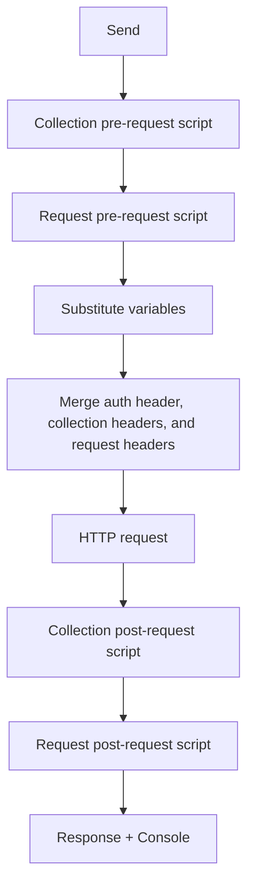

# Collections

Collections are named groups of saved HTTP requests. Each collection can define shared **variables**, **headers**, **authorization**, and **pre/post scripts** that apply to every request inside it.

The **Collections** section in the left sidebar sits above **Environments**. Both sections can be collapsed independently by clicking the section header.

## Sidebar guide

The sidebar is the main place to browse and manage collections.

### Expand and select

- **Expand/collapse** (▶/▼ chevron) — toggles the list of saved requests without changing which collection is selected. Requests load when a collection is expanded.
- **Select** (click the collection name) — highlights the row and loads its saved requests. If the collection was collapsed, it expands automatically.
- **Settings** — double-click the collection name to open Collection Settings.

### Saved requests and folders

When a collection is expanded, **folders** (if any) appear first, followed by root-level saved requests. Click a folder's chevron to expand or collapse the requests inside it.

Each request row shows the HTTP method badge and request name.

- Click a request to open it in a tab. If the request is already open, HarborClient focuses that tab.
- The currently open saved request is highlighted in the sidebar.
- If a collection has no folders or requests, **No saved requests** is shown.

### Organizing with folders

Use **New Folder** in a collection's row menu to create a folder. Folder actions:

| Action | How |
| --- | --- |
| **New Request** | Row menu on the folder — creates a saved request inside the folder |
| **Rename** | Row menu → **Rename** |
| **Delete** | Row menu → **Delete** — removes the folder and all requests inside it |

Drag and drop to reorder collections, folders, and requests within a folder or at the collection root, and move requests between folders and the root. While dragging a request, the target folder or collection root is highlighted so you can see where it will land. You can also use **Move to root** in a request's row menu.

### Empty state and ordering

- When you have no collections, the sidebar shows **No collections yet**.
- Collections are ordered by drag-and-drop position in the sidebar.
- Folders are ordered by drag-and-drop position within the collection.
- Saved requests are ordered by their position within a folder or at the collection root, then by name.

### Selection persistence

The highlighted collection in the sidebar is remembered for the current session only — it is not restored after you restart the app. When HarborClient starts and collections exist, the first collection in the sidebar order is selected automatically.

## Creating collections

| Trigger | Result |
| --- | --- |
| Sidebar **+** button | Opens the **Add collection** modal |
| **File → New Collection** or **Cmd/Ctrl+Shift+N** | Same modal |
| **File → Save** with no collection selected | Opens **Create & Save** — create a collection, then save the active request into it |

In the **Add collection** modal you can:

- **Create new** — enter a name, choose a **Provider** (SQLite, a remote database, or a [service hub](/service-hubs)), and click **Create**
- **Import from file** — pick a HarborClient `.json` export (same as **File → Import**)
- **Accept invite** — paste an invite token to connect to a shared remote collection (see [Sharing collections](#sharing-collections))

## Renaming and deleting

### Rename a collection

Renaming is done in **Collection Settings → General**. There is no Rename option in the sidebar row menu. Press Enter to confirm the name; press Escape to cancel.

### Delete a collection

Choose **Delete** from the collection row menu (visible on hover). HarborClient asks you to confirm. Deleting a collection permanently removes it and **all saved requests** inside it.

### Delete a saved request

Choose **Delete** from the request row menu. Confirm the dialog to remove the request from the collection.

### Duplicate a saved request

Choose **Duplicate** from the request row menu. HarborClient creates a copy in the same folder (or at the collection root) named `{name} (copy)`, places it directly below the original, and opens the copy in a new tab. The original request is unchanged.

### Duplicate a collection

Choose **Duplicate** from the collection row menu. HarborClient creates a copy named `{name} (copy)` on the same database, placed directly below the original in the sidebar. The copy includes collection settings (variables, headers, authorization, and scripts), all folders, and all saved requests. The original collection is unchanged.

## Collection Settings

Collection Settings is a full-area view that replaces the request editor while it is open. Open it by:

- Double-clicking a collection in the sidebar
- Choosing **Settings** from the collection row menu
- Clicking **Edit value** on a `{{variable}}` tooltip in the request editor (when a collection is active)

### Settings tabs

| Tab | Purpose |
| --- | --- |
| **General** | Collection name |
| **Variables** | Shared variables for `{{key}}` substitution |
| **Headers** | Headers sent with every request in the collection |
| **Authorization** | Default Basic Auth or Bearer Token for every request in the collection |
| **PreRequest** | JavaScript run before each request in the collection |
| **PostRequest** | JavaScript run after each request in the collection |

### Variables

Each variable has four fields:

| Field | Description |
| --- | --- |
| **Key** | Variable name used in `{{key}}` placeholders |
| **Value** | Value substituted when the variable is resolved |
| **Default** | Used when Value is empty |
| **Share** | When checked, Value is included in collection exports |

Collection variables support `{{key}}` syntax in URLs, headers, params, body, and scripts. When Value is empty, HarborClient uses Default instead.

At send time, collection variables are loaded first; active [environment](/environments) variables override collection variables when both define the same key. See [Environments](/environments) for details.

### Headers

Collection headers are sent with every request in the collection. Header values support `{{variable}}` syntax. Each row has an enable checkbox — disabled rows are excluded.

Request-level headers override collection headers when both define the same header name (case-insensitive). See [Making requests](/requests#headers) for merge rules.

### Authorization

The **Authorization** tab configures default authentication for every request in the collection. Choose an **Auth Type**:

| Auth Type | Fields |
| --- | --- |
| **None** | No collection-level authorization is configured |
| **Basic Auth** | Username and password |
| **Bearer Token** | Token value |

All credential fields support `{{variable}}` syntax. At send time, HarborClient generates an `Authorization` header from the selected type (`Basic …` or `Bearer …`) after variables are resolved.

Request-level authorization overrides collection authorization when the request's Auth Type is **Basic Auth** or **Bearer Token**. When a request's Auth Type is **None**, the collection's authorization still applies.

A manually typed `Authorization` header (in the Headers tab, or set by a pre-request script) always wins over the Authorization tab. See [Making requests — Authorization](/requests#authorization) for the full precedence rules.

### Scripts

Collection pre- and post-request scripts run for every request in the collection, before and after request-level scripts. See [Request scripts](/request-scripts) for the `hc` API, execution order, and sandbox limits.

### Save and cancel

- Click **Save** to persist changes. Empty variable and header rows are stripped automatically. A **Collection updated** toast confirms success.
- Click **Cancel** or **X** to close without saving. HarborClient does not prompt — unsaved edits are discarded.
- If you try to open a saved request from the sidebar while Collection Settings has unsaved changes, HarborClient warns you first.

## Working with saved requests

| Action | How |
| --- | --- |
| **New Request in collection** | Collection row menu → **New Request**. HarborClient immediately saves an **Untitled Request** and opens it in a new tab. |
| **Open saved request** | Click the request in the sidebar |
| **Rename request** | Click the request name in the request editor (not in the sidebar) |
| **Save changes** | **File → Save** or **Cmd/Ctrl+S** — saves to the **sidebar-selected** collection |
| **Update vs copy** | If the tab already belongs to the target collection, HarborClient updates the existing request. Otherwise it creates a new saved request. Saving while a different collection is selected in the sidebar creates a **copy** in that collection — there is no move action. |

When a request belongs to a collection, the request editor shows a breadcrumb: `CollectionName > Request name`.

For building and sending requests, see [Making requests](/requests).

## Import and export

### Export

Choose **Export** from the collection row menu. HarborClient opens a save dialog with a default filename of `{collection-name}.json`. After a successful export, a **Collection exported** toast appears.

Variables with **Share** unchecked have their **Value** cleared in the export file. Key, Default, and the Share flag are kept so you can share exports without exposing secrets.

### Import

Import a collection from a `.json` file using either:

- **File → Import** (auto-detects collection, request, and environment exports — see below)
- **Add collection → Import from file**

Import always creates a **new** collection. It does not merge into or replace an existing collection. On success, HarborClient selects the imported collection and shows a **Collection imported** toast.

If the file is invalid, HarborClient shows an alert with a descriptive error (for example, unsupported format version, missing collection name, or malformed request). Canceling the file dialog does nothing.

#### File → Import (all export types)

**File → Import** opens one file picker and auto-detects the export type from the file contents:

| Export type | Behavior |
| --- | --- |
| Collection (HarborClient or Postman) | Creates a new collection and selects it |
| Request | Imports into the **currently selected collection** at the root; requires a selected collection |
| Environment | Creates a new environment and activates it |

If you import a request file with no collection selected, HarborClient shows an alert asking you to select a collection first.

#### Postman collections

HarborClient also accepts **Postman v2.1 collection exports** (`.json` files exported from Postman). Postman files are detected automatically by `info._postman_id` in the JSON.

When you import a Postman collection, HarborClient shows a warning that not all Postman features are supported. Choose **Import anyway** to continue.

HarborClient imports:

- Collection name, variables, Basic Auth, and Bearer Token authorization
- Saved requests (method, URL, headers, body, and description)
- Folders (nested Postman folders are flattened into a single level using `Parent / Child` names)
- Pre-request and post-request script text (imported verbatim)

The following Postman features are **ignored** or converted:

| Postman feature | HarborClient behavior |
| --- | --- |
| API Key, OAuth 2, and other auth types | Dropped (request uses no auth override) |
| GraphQL and file request bodies | Body omitted (`none`) |
| Saved example responses | Ignored |
| URL path variables (`:id`) | Kept in the URL string only |
| Collection/folder descriptions | Ignored |
| Disabled query params in the URL object | URL uses the raw string as exported |

Scripts imported from Postman use the `pm.*` API in Postman but run in HarborClient's `hc` sandbox — they may not behave the same way after import.

### Export file format

HarborClient collection export files require `harborclientExport: "collection"` and `harborclientVersion: 1`. They contain the collection name, variables, headers, authorization, scripts, folders, and all saved requests. Database IDs are not included.

Example (abbreviated):

```json
{
  "harborclientVersion": 1,
  "harborclientExport": "collection",
  "name": "My API",
  "variables": [
    { "key": "baseUrl", "value": "https://api.example.com", "defaultValue": "", "share": true }
  ],
  "headers": [
    { "key": "Accept", "value": "application/json", "enabled": true }
  ],
  "auth": {
    "type": "bearer",
    "basic": { "username": "", "password": "" },
    "bearer": { "token": "{{token}}" }
  },
  "pre_request_script": "",
  "post_request_script": "",
  "folders": [],
  "requests": [
    {
      "name": "Get status",
      "method": "GET",
      "url": "{{baseUrl}}/v1/status",
      "params": [],
      "headers": [],
      "auth": {
        "type": "none",
        "basic": { "username": "", "password": "" },
        "bearer": { "token": "" }
      },
      "body_type": "none",
      "body": "",
      "pre_request_script": "",
      "post_request_script": "",
      "sort_order": 0
    }
  ]
}
```

Common validation errors:

| Error | Cause |
| --- | --- |
| `unsupported format version` | `harborclientVersion` is not `1` |
| `not a HarborClient collection export` | `harborclientExport` is not `"collection"` |
| `collection name is required` | Name is missing or blank |
| `requests must be an array` | `requests` field is missing or wrong type |
| `request N has an invalid method` | Method is not a supported HTTP method |
| `request N has an invalid body type` | `body_type` is not `none`, `json`, `text`, `multipart`, or `urlencoded` |
| `request N is missing a name` | Request name is blank |

### Request export format

Individual requests can be exported from the request row menu in the sidebar. Request export files require `harborclientExport: "request"` and `harborclientVersion: 1`. They contain request fields only (name, method, URL, headers, params, auth, body, scripts, comment). Folder information is not included.

Import a request export via **Import Request** in a collection or folder row menu, or via **File → Import** when a collection is selected in the sidebar. Collection root imports place the request at the root; folder imports place it inside that folder.

Example (abbreviated):

```json
{
  "harborclientVersion": 1,
  "harborclientExport": "request",
  "name": "Get status",
  "method": "GET",
  "url": "{{baseUrl}}/v1/status",
  "params": [],
  "headers": [],
  "auth": {
    "type": "none",
    "basic": { "username": "", "password": "" },
    "bearer": { "token": "" }
  },
  "body_type": "none",
  "body": "",
  "pre_request_script": "",
  "post_request_script": "",
  "comment": ""
}
```

## Sharing collections

Use **Export/Import** when you want a portable snapshot of a collection — a `.json` file you can version, email, or archive. Use **invites** when you want another HarborClient user to connect to the same **live** collection on a remote database. Use **[service hubs](/service-hubs)** when your team shares collections through HarborClient Server with API tokens instead of shared database credentials. Invited and hub-backed collections stay in sync with the shared backend; changes from other users appear when data is reloaded (for example, after restarting the app). See [Settings → Databases](/settings#databases) for how remote backends work.

Before sending or accepting invites, exchange public keys with your colleague — see [Certificates](/certificates).

### Sending an invite

| Step | Action |
| --- | --- |
| 1 | Ensure the collection is stored on a **remote** database (Firestore, MySQL, or PostgreSQL), not SQLite |
| 2 | Open the collection row menu → **Invite** |
| 3 | Copy the generated token and send it to the recipient over a trusted channel |

HarborClient opens an **Invite to collection** modal and generates a token for the selected collection. Click **Copy** to put the token on the clipboard.

The **Invite** menu item is hidden for collections stored in SQLite — only remote databases can be shared this way.

The token embeds **database connection credentials**. Treat it like a secret and share it only with people who should have access to that database and collection.

Tell recipients they must **restart HarborClient** after accepting the invite.

### Accepting an invite

| Step | Action |
| --- | --- |
| 1 | Click the sidebar **+** button (or **File → New Collection**) |
| 2 | In **Add collection**, open the **Accept invite** tab |
| 3 | Paste the token and click **Accept** |
| 4 | Restart HarborClient |

On success, HarborClient shows a **Shared connection added** toast. The new connection appears under [Settings → Databases](/settings#databases), and the shared collection appears in the sidebar. When a collection is stored on a non-active database, its row shows a connection badge with the database name.

Accepting an invite is **not** the same as import — it adds a live database connection and registers the shared collection, not a new local copy from a `.json` file.

If the token is invalid, HarborClient shows an alert with a descriptive error (for example, malformed token, unsupported version, or missing connection).

### Invite vs manual database setup

Teammates can also share access by configuring the same remote database manually in [Settings → Databases](/settings#databases). Invites bundle the connection details and collection mapping in one step so the recipient does not have to enter credentials by hand.

## How collections affect sends

When you send a request, HarborClient determines which collection applies:

- **Saved request** — the collection the request belongs to
- **Unsaved tab** — the collection currently selected in the sidebar

That collection provides variables, headers, authorization, and scripts for the send:

- **Variables** — collection variables load first; the active environment overrides duplicate keys. See [Environments](/environments).
- **Headers** — collection headers merge with request headers; request headers win on duplicates.
- **Authorization** — when configured, HarborClient generates an `Authorization` header unless the request or scripts already set one manually. Request-level Basic or Bearer overrides collection auth; request **None** inherits collection auth.
- **Scripts** — collection pre-request → request pre-request → HTTP request → collection post-request → request post-request.



For the full send pipeline and response handling, see [Making requests](/requests).

## Storage and backup

Collections and saved requests are stored in your chosen provider:

- **SQLite (default)** — `{userData}/harborclient.db`. The database filename can be changed in [Settings → SQLite](/settings#sqlite) (restart required).
- **Firestore, MySQL, PostgreSQL** — remote storage when selected in [Settings → Databases](/settings#databases) (restart required).
- **Service hubs** — collection data on [HarborClient Server](/service-hubs); configured under **File → Service Hubs**, not in Settings.

See [Settings](/settings) for database configuration and [Service hubs](/service-hubs) for hub-backed collections.

Open tab drafts are stored separately in browser `localStorage`. The selected collection in the sidebar is not persisted.

To back up a collection, use **Export** to save a portable JSON file. Deleting a collection from the sidebar permanently removes it and all its requests from the database.

## Keyboard shortcuts

| Action | Shortcut |
| --- | --- |
| New collection | Cmd/Ctrl+Shift+N |
| Save request | Cmd/Ctrl+S |
| Import collection | **File → Import** (no keyboard shortcut) |

## What's next

- [Making requests](/requests) — build, send, and inspect HTTP requests
- [Environments](/environments) — global variable groups that override collection variables
- [Request scripts](/request-scripts) — collection and request scripts, tests, and the `hc` API
