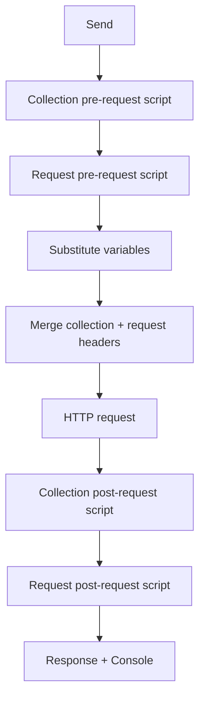

# Collections

Collections are named groups of saved HTTP requests. Each collection can define shared **variables**, **headers**, and **pre/post scripts** that apply to every request inside it.

The **Collections** section in the left sidebar sits above **Environments**. Both sections can be collapsed independently by clicking the section header.

## Sidebar guide

The sidebar is the main place to browse and manage collections.

### Expand and select

- **Expand/collapse** (▶/▼ chevron) — toggles the list of saved requests without changing which collection is selected. Requests load when a collection is expanded.
- **Select** (click the collection name) — highlights the row and loads its saved requests. If the collection was collapsed, it expands automatically.
- **Settings** — double-click the collection name to open Collection Settings.

### Saved requests

When a collection is expanded, its saved requests appear indented below the collection name. Each row shows the HTTP method badge and request name.

- Click a request to open it in a tab. If the request is already open, HarborClient focuses that tab.
- The currently open saved request is highlighted in the sidebar.
- If a collection has no saved requests, **No saved requests** is shown.

### Empty state and ordering

- When you have no collections, the sidebar shows **No collections yet**.
- Collections are listed alphabetically by name.
- Saved requests are ordered by their sort position, then by name.

### Selection persistence

The highlighted collection in the sidebar is remembered for the current session only — it is not restored after you restart the app. When HarborClient starts and collections exist, the first collection (alphabetically) is selected automatically.

## Creating collections

| Trigger | Result |
| --- | --- |
| Sidebar **+** button | Opens the **Add collection** modal |
| **File → New Collection** or **Cmd/Ctrl+Shift+N** | Same modal |
| **File → Save** with no collection selected | Opens **Create & Save** — create a collection, then save the active request into it |

In the **Add collection** modal you can:

- **Create new** — enter a name and click **Create**
- **Import from file** — pick a HarborClient `.json` export (same as **File → Import**)

## Renaming and deleting

### Rename a collection

Renaming is done in **Collection Settings → General**. There is no Rename option in the sidebar row menu. Press Enter to confirm the name; press Escape to cancel.

### Delete a collection

Choose **Delete** from the collection row menu (visible on hover). HarborClient asks you to confirm. Deleting a collection permanently removes it and **all saved requests** inside it.

### Delete a saved request

Choose **Delete** from the request row menu. Confirm the dialog to remove the request from the collection.

## Collection Settings

Collection Settings is a full-area view that replaces the request editor while it is open. Open it by:

- Double-clicking a collection in the sidebar
- Choosing **Settings** from the collection row menu
- Clicking **Edit value** on a `{{variable}}` tooltip in the request editor (when a collection is active)

### Settings tabs

| Tab | Purpose |
| --- | --- |
| **General** | Collection name |
| **Variables** | Shared variables for `{{key}}` substitution |
| **Headers** | Headers sent with every request in the collection |
| **PreRequest** | JavaScript run before each request in the collection |
| **PostRequest** | JavaScript run after each request in the collection |

### Variables

Each variable has four fields:

| Field | Description |
| --- | --- |
| **Key** | Variable name used in `{{key}}` placeholders |
| **Value** | Value substituted when the variable is resolved |
| **Default** | Used when Value is empty |
| **Share** | When checked, Value is included in collection exports |

Collection variables support `{{key}}` syntax in URLs, headers, params, body, and scripts. When Value is empty, HarborClient uses Default instead.

At send time, collection variables are loaded first; active [environment](/environments) variables override collection variables when both define the same key. See [Environments](/environments) for details.

### Headers

Collection headers are sent with every request in the collection. Header values support `{{variable}}` syntax. Each row has an enable checkbox — disabled rows are excluded.

Request-level headers override collection headers when both define the same header name (case-insensitive). See [Making requests](/requests#headers) for merge rules.

### Scripts

Collection pre- and post-request scripts run for every request in the collection, before and after request-level scripts. See [Request scripts](/request-scripts) for the `hc` API, execution order, and sandbox limits.

### Save and cancel

- Click **Save** to persist changes. Empty variable and header rows are stripped automatically. A **Collection updated** toast confirms success.
- Click **Cancel** or **X** to close without saving. HarborClient does not prompt — unsaved edits are discarded.
- If you try to open a saved request from the sidebar while Collection Settings has unsaved changes, HarborClient warns you first.

## Working with saved requests

| Action | How |
| --- | --- |
| **New Request in collection** | Collection row menu → **New Request**. HarborClient immediately saves an **Untitled Request** and opens it in a new tab. |
| **Open saved request** | Click the request in the sidebar |
| **Rename request** | Click the request name in the request editor (not in the sidebar) |
| **Save changes** | **File → Save** or **Cmd/Ctrl+S** — saves to the **sidebar-selected** collection |
| **Update vs copy** | If the tab already belongs to the target collection, HarborClient updates the existing request. Otherwise it creates a new saved request. Saving while a different collection is selected in the sidebar creates a **copy** in that collection — there is no move action. |

When a request belongs to a collection, the request editor shows a breadcrumb: `CollectionName > Request name`.

For building and sending requests, see [Making requests](/requests).

## Import and export

### Export

Choose **Export** from the collection row menu. HarborClient opens a save dialog with a default filename of `{collection-name}.json`. After a successful export, a **Collection exported** toast appears.

Variables with **Share** unchecked have their **Value** cleared in the export file. Key, Default, and the Share flag are kept so you can share exports without exposing secrets.

### Import

Import a collection from a `.json` file using either:

- **File → Import**
- **Add collection → Import from file**

Import always creates a **new** collection. It does not merge into or replace an existing collection. On success, HarborClient selects the imported collection and shows a **Collection imported** toast.

If the file is invalid, HarborClient shows an alert with a descriptive error (for example, unsupported format version, missing collection name, or malformed request). Canceling the file dialog does nothing.

### Export file format

HarborClient export files use `formatVersion: 1`. They contain the collection name, variables, headers, scripts, and all saved requests. Database IDs are not included.

Example (abbreviated):

```json
{
  "formatVersion": 1,
  "name": "My API",
  "variables": [
    { "key": "baseUrl", "value": "https://api.example.com", "defaultValue": "", "share": true }
  ],
  "headers": [
    { "key": "Accept", "value": "application/json", "enabled": true }
  ],
  "pre_request_script": "",
  "post_request_script": "",
  "requests": [
    {
      "name": "Get status",
      "method": "GET",
      "url": "{{baseUrl}}/v1/status",
      "params": [],
      "headers": [],
      "body_type": "none",
      "body": "",
      "pre_request_script": "",
      "post_request_script": "",
      "sort_order": 0
    }
  ]
}
```

Common validation errors:

| Error | Cause |
| --- | --- |
| `unsupported format version` | `formatVersion` is not `1` |
| `collection name is required` | Name is missing or blank |
| `requests must be an array` | `requests` field is missing or wrong type |
| `request N has an invalid method` | Method is not a supported HTTP method |
| `request N has an invalid body type` | `body_type` is not `none`, `json`, or `text` |
| `request N is missing a name` | Request name is blank |

## How collections affect sends

When you send a request, HarborClient determines which collection applies:

- **Saved request** — the collection the request belongs to
- **Unsaved tab** — the collection currently selected in the sidebar

That collection provides variables, headers, and scripts for the send:

- **Variables** — collection variables load first; the active environment overrides duplicate keys. See [Environments](/environments).
- **Headers** — collection headers merge with request headers; request headers win on duplicates.
- **Scripts** — collection pre-request → request pre-request → HTTP request → collection post-request → request post-request.



For the full send pipeline and response handling, see [Making requests](/requests).

## Storage and backup

Collections and saved requests are stored in your chosen database backend:

- **SQLite (default)** — `{userData}/harborclient.db`. The database filename can be changed in [Settings → SQLite](/settings#sqlite) (restart required).
- **Firestore** — cloud storage when selected in [Settings → General](/settings#general) (restart required).
- **MySQL** — remote storage when selected in [Settings → General](/settings#general) (restart required).

See [Settings](/settings) for full configuration details.

Open tab drafts are stored separately in browser `localStorage`. The selected collection in the sidebar is not persisted.

To back up a collection, use **Export** to save a portable JSON file. Deleting a collection from the sidebar permanently removes it and all its requests from the database.

## Keyboard shortcuts

| Action | Shortcut |
| --- | --- |
| New collection | Cmd/Ctrl+Shift+N |
| Save request | Cmd/Ctrl+S |
| Import collection | **File → Import** (no keyboard shortcut) |

## Limitations

HarborClient does not currently support:

- Drag-and-drop reordering of collections or requests
- Duplicating a collection or request from the sidebar
- Moving a request between collections (saving to a different collection creates a copy)
- Merging an import into an existing collection
- Renaming a collection inline in the sidebar (use Collection Settings)
- A save prompt when closing Collection Settings with unsaved edits (only navigation away while dirty warns you)

## What's next

- [Making requests](/requests) — build, send, and inspect HTTP requests
- [Environments](/environments) — global variable groups that override collection variables
- [Request scripts](/request-scripts) — collection and request scripts, tests, and the `hc` API
