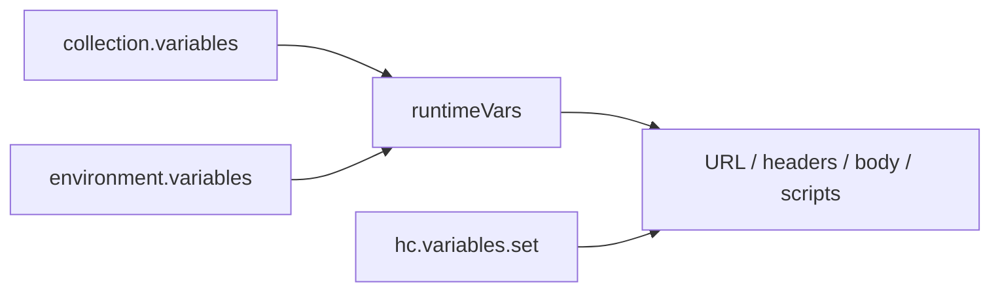

# Environments

Environments are app-wide groups of variables. Unlike collection variables, which belong to a single collection, environments are global: you create them once and can activate any environment from the TabBar while working across collections and tabs.

One active environment is shared across all open request tabs. When an environment is selected, its variables become available to every request you send.

## Managing environments

The **Environments** section in the sidebar sits below **Collections**. Each section can be collapsed independently.

- **Add** — Click the `+` button in the Environments header to open the **Add environment** dialog. Use **Create new** to enter a name, or **Import from file** to load a HarborClient environment export.
- **Activate** — Click an environment name to make it the active environment. The selected row is highlighted.
- **Settings** — Double-click an environment, or choose **Settings** from the row menu, to open environment settings. Edit the name and variables, then save.
- **Export** — Choose **Export** from the row menu. HarborClient opens a save dialog with a default filename of `{environment-name}.json`.
- **Delete** — Choose **Delete** from the row menu. This removes the environment and clears the active selection if it was selected.

## Selecting an environment

Use the environment dropdown on the far right of the TabBar. Choose an environment name to activate it, or **No Environment** to clear the selection.

The active environment persists across app restarts. All tabs share the same selection.

## Variables

Environment variables use the same shape as collection variables and support `{{key}}` syntax in:

- Request URLs
- Headers and query params
- Request body
- Pre- and post-request script source

Each variable has four fields:

| Field | Description |
| --- | --- |
| **Key** | Variable name referenced in `{{key}}` placeholders |
| **Value** | Value substituted when the variable is resolved |
| **Default** | Used when Value is empty |
| **Share** | When unchecked, the variable **Value** is cleared in environment exports (Key, Default, and Share are kept) |

When Value is empty, HarborClient uses Default instead.

## Precedence

At send time, HarborClient builds a runtime variable map from the active collection and the active environment. Collection variables are loaded first; environment variables are applied on top. When both define the same key, the **environment wins**.

Values set with `hc.variables.set` in a pre- or post-request script override both collection and environment variables for the remainder of that send. See [Request scripts](/request-scripts) for script execution order and the `hc.variables` API.



The request editor highlights `{{variable}}` tokens using the merged set of collection and environment variables, with environment values shown when keys overlap.

## Storage

Environment records are stored alongside collections and requests:

- **SQLite** — `environments` table in `{userData}/harborclient.db`
- **Firestore** — `environments` collection when using the Firestore database provider
- **MySQL** — `environments` table when using the MySQL database provider

See [Settings](/settings) for database provider and connection configuration.

The active environment ID is stored in browser `localStorage` under `harborclient.activeEnvironmentId`, not in the database.

## Export and import

### Export

Choose **Export** from the environment row menu. HarborClient opens a save dialog with a default filename of `{environment-name}.json`. After a successful export, an **Environment exported** toast appears.

Variables with **Share** unchecked have their **Value** cleared in the export file. Key, Default, and the Share flag are kept so you can share exports without exposing secrets.

### Import

Import an environment from a `.json` file using either:

- **File → Import** (auto-detects environment exports)
- **Add environment → Import from file**

Import always creates a **new** environment. It does not merge into or replace an existing environment. On success, HarborClient activates the imported environment and shows an **Environment imported** toast.

If the file is invalid, HarborClient shows an alert with a descriptive error (for example, unsupported format version or missing environment name). Canceling the file dialog does nothing.

### Export file format

HarborClient environment export files require `harborclientExport: "environment"` and `harborclientVersion: 1`. They contain the environment name and variables. Database IDs are not included.

Example (abbreviated):

```json
{
  "harborclientVersion": 1,
  "harborclientExport": "environment",
  "name": "Staging",
  "variables": [
    { "key": "baseUrl", "value": "https://staging.example.com", "defaultValue": "", "share": true }
  ]
}
```

Common validation errors:

| Error | Cause |
| --- | --- |
| `unsupported format version` | `harborclientVersion` is not `1` |
| `not a HarborClient environment export` | `harborclientExport` is not `"environment"` |
| `environment name is required` | Name is missing or blank |
