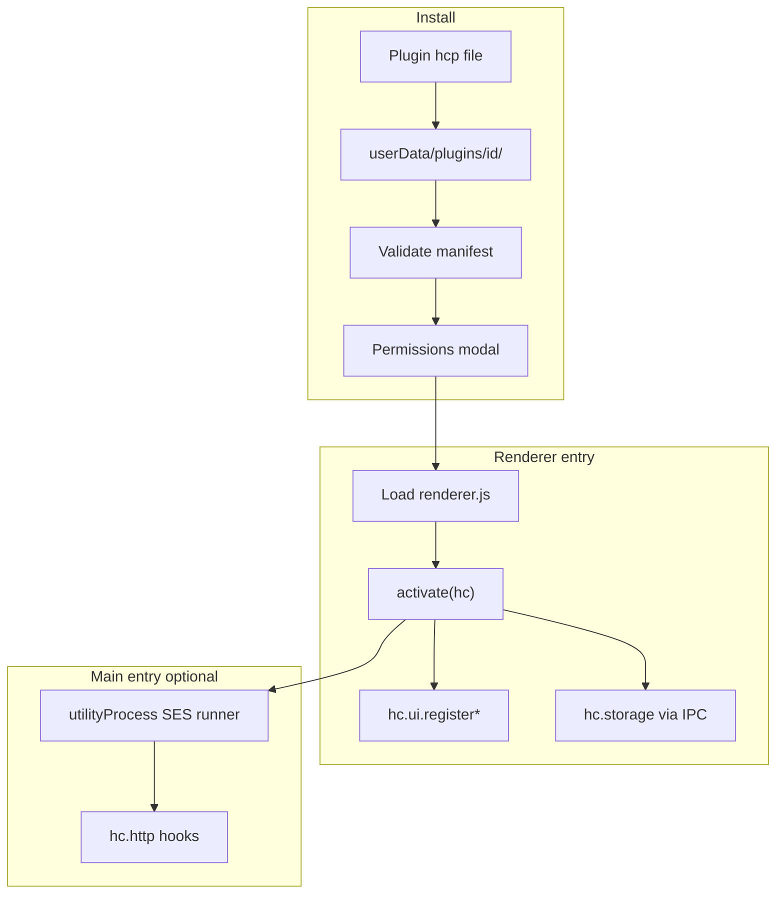
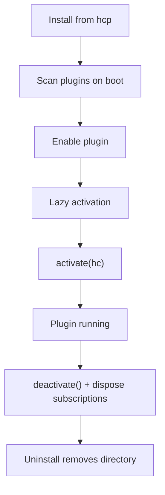
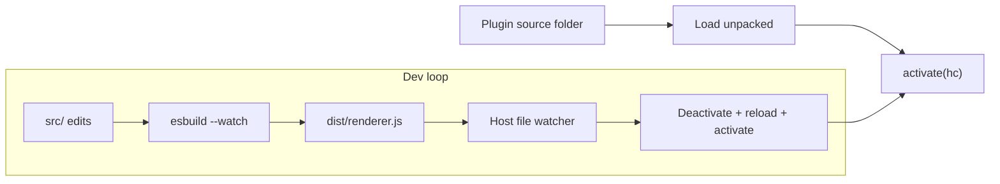

# Plugin development

HarborClient plugins extend the app with installable packages: custom settings panels, sidebar views, request tabs, appearance themes, HTTP hooks, and persistent storage. Each plugin ships as a **HarborClient plugin** file (`.hcp`) containing a `manifest.json` and bundled JavaScript. A `.hcp` file is a normal ZIP archive — the extension is a naming convention only, not a separate container format. Plugins use the same `hc` namespace as [request scripts](/request-scripts), but with a broader API suited to long-lived extensions.

To install or manage plugins in the app, see [Settings → Plugins](/settings#plugins). This guide covers package layout, the manifest, APIs, examples, and the development workflow.

## Plugin package layout

Author source in JS or TS, bundle to `dist/*.js`, then pack the manifest and output files into a `.hcp` file (ZIP format):

```
my-plugin/
├── manifest.json
├── README.md               # or description.md — full Markdown listing (see manifest)
├── assets/
│   ├── icon.png            # plugin icon (referenced by manifest)
│   └── screenshots/        # gallery images for Settings → Plugins detail
│       ├── settings.png
│       └── sidebar.png
├── src/                    # author source (optional, not loaded at runtime)
│   ├── renderer.tsx
│   └── main.ts
└── dist/
    ├── renderer.js         # referenced by manifest "renderer"
    ├── main.js             # referenced by manifest "main" (optional)
    └── theme.css           # optional stylesheet for contributes.themes
```

At runtime HarborClient reads `manifest.json`, the Markdown description, icon, screenshots, and the files referenced under `dist/`.

## manifest.json

Every plugin requires a manifest at the root of the `.hcp` archive. The example below shows every field; real plugins usually declare only the entries they use.

```json
{
  "id": "com.example.my-plugin",
  "name": "My Plugin",
  "version": "1.0.0",

  "company": "Example Inc.",
  "description": "README.md",
  "icon": "assets/icon.png",
  "screenshots": [
    {
      "path": "assets/screenshots/settings.png",
      "caption": "Settings panel"
    },
    {
      "path": "assets/screenshots/sidebar.png",
      "caption": "Sidebar tools"
    }
  ],
  "homepage": "https://example.com/my-plugin",
  "bugs": {
    "url": "https://github.com/example/my-plugin/issues"
  },

  "engines": {
    "harborclient": ">=1.7.0"
  },
  "renderer": "dist/renderer.js",
  "main": "dist/main.js",
  "permissions": ["ui", "storage"],

  "contributes": {
    "settingsSections": [
      { "id": "myPlugin.settings", "title": "My Plugin" }
    ],
    "sidebarPanels": [
      { "id": "myPlugin.panel", "title": "My Plugin" }
    ],
    "sidebarSections": [
      { "id": "myPlugin.section", "title": "My Plugin" }
    ],
    "mainViews": [
      { "id": "myPlugin.view", "title": "My Plugin" }
    ],
    "requestTabs": [
      { "id": "myPlugin.requestTab", "title": "Audit" }
    ],
    "responseTabs": [
      { "id": "myPlugin.responseTab", "title": "Summary" }
    ],
    "collectionSettingsTabs": [
      { "id": "myPlugin.collTab", "title": "Plugin" }
    ],
    "footerPanels": [
      { "id": "myPlugin.footer", "title": "My Plugin" }
    ],
    "requestToolbarActions": [
      { "id": "myPlugin.sendAction", "title": "Run check" }
    ],
    "contextMenus": [
      { "id": "myPlugin.requestMenu", "title": "Plugin action" }
    ],
    "statusBarItems": [
      { "id": "myPlugin.status", "title": "Status" }
    ],
    "themes": [
      { "id": "solarized", "title": "Solarized Dark", "type": "dark" }
    ],
    "commands": [
      { "id": "myPlugin.run", "title": "Run plugin command" }
    ],
    "menus": [
      {
        "menu": "view",
        "command": "myPlugin.run",
        "group": "plugin"
      }
    ]
  }
}
```

| Field | Required | Description |
| ----- | -------- | ----------- |
| `id` | Yes | Reverse-DNS identifier. Namespaces storage and plugin updates. |
| `name` | Yes | Display name shown in Settings and install dialogs. |
| `version` | Yes | Semver version string. |
| `company` | No | Publisher or company name shown on the plugin detail page. |
| `description` | No | Path to a Markdown file (for example `README.md`) with the full plugin description. Rendered in **Settings → Plugins** detail view. |
| `icon` | No | Path to a square PNG or SVG icon (recommended 128×128 px or larger). Shown in the plugin list and install dialog. |
| `screenshots` | No | Gallery images for the plugin detail page. See [Screenshots](#screenshots) below. |
| `homepage` | No | URL to the plugin's website or documentation. Shown as a link on the detail page. |
| `bugs` | No | Issue tracker for bug reports. Use `{ "url": "https://…" }`. Shown as **Report issue** on the detail page. |
| `engines.harborclient` | Yes | Minimum HarborClient version (for example `>=1.7.0`). |
| `renderer` | No | Path to the renderer entry bundle (UI). |
| `main` | No | Path to the main entry bundle (hooks, IPC, logic). |
| `permissions` | Yes | Capabilities the plugin needs. Summarized in the install confirmation dialog. |
| `contributes` | No | Declarative UI slots listed before plugin code activates. |

### Plugin metadata

Listing metadata is separate from `contributes` — it describes the package for users browsing **Settings → Plugins**, not UI slots inside the app.

#### description

Points to a Markdown file at the plugin package root (relative path only; no absolute paths or URLs). HarborClient renders the file in the plugin detail view with the same Markdown subset used elsewhere in the app (headings, lists, links, code fences, emphasis).

Use this for install-time documentation: features, setup notes, permission rationale, and changelog highlights. Keep `manifest.json` lean; put prose in `README.md` or `description.md`.

```markdown
# My Plugin

Logs every outbound HTTP request to the terminal and adds a **Solarized Dark** theme.

## Permissions

- `http` — before/after send hooks for request logging
- `ui` — theme registration
```

#### icon

Path to a PNG or SVG under the plugin directory. Recommended **128×128 px** minimum; HarborClient scales down for list rows and up for the detail header. Use a transparent background for PNG icons.

#### Screenshots

An array of screenshot entries. Each entry is either:

- a **string** — plugin-relative image path, or
- an **object** — `{ "path": "assets/…", "caption": "Optional label" }`

Supported formats: PNG, JPEG, WebP. Recommended width **1280 px** or wider; HarborClient scales images to fit the detail gallery. Include two to five screenshots that show primary UI contributions.

```json
"screenshots": [
  "assets/screenshots/overview.png",
  { "path": "assets/screenshots/settings.png", "caption": "Plugin settings" }
]
```

#### company, homepage, and bugs

| Field | Example | Shown in UI |
| ----- | ------- | ----------- |
| `company` | `"Acme HTTP Tools"` | Publisher line on detail page |
| `homepage` | `"https://example.com/my-plugin"` | **Website** link |
| `bugs.url` | `"https://github.com/example/my-plugin/issues"` | **Report issue** link |

All URL fields must use `https://` (or `http://` for local development documentation only). HarborClient opens links in the system default browser.

### Contribution types

The `contributes` block declares where your plugin can appear. Each entry's `id` must match the `id` passed to the corresponding `hc.ui.register*` call at activation time.

| Manifest key | `hc.ui` registrar | UI surface |
| ------------ | ----------------- | ---------- |
| `settingsSections` | `registerSettingsSection` | Settings sidebar and panel |
| `sidebarPanels` | `registerSidebarPanel` | Switchable left sidebar destination |
| `sidebarSections` | `registerSidebarSection` | Collapsible block inside the scrollable sidebar |
| `mainViews` | `registerMainView` | Full main-area overlay (Team Hubs pattern) |
| `requestTabs` | `registerRequestTab` | Request editor segmented tabs |
| `responseTabs` | `registerResponseTab` | Response viewer tabs |
| `collectionSettingsTabs` | `registerCollectionSettingsTab` | Collection settings segmented tabs |
| `footerPanels` | `registerFooterPanel` | Slide-up footer panel |
| `requestToolbarActions` | `registerRequestToolbarAction` | Button near Send in the URL bar |
| `contextMenus` | `registerContextMenuItem` | Row actions on sidebar collections, folders, requests |
| `statusBarItems` | `registerStatusBarItem` | Footer status area (beside sidebar / AI toggles) |
| `themes` | `hc.themes.register` | Appearance theme in Settings → General |
| `commands` | `hc.commands.register` | Command handlers (menus, toolbar, context menus) |
| `menus` | `registerMenuItem` | File, Edit, View, or Help application menu |

Settings sections ship in the initial plugin release. Other contribution types are part of the target API documented below and will roll out in subsequent HarborClient versions. Declare them in the manifest now so install dialogs and future host versions can discover slots before your code loads.

## Permissions

HarborClient uses a trusted-extension model similar to VS Code or Obsidian. Permissions are shown at install time and enforced in the main process on every privileged `hc.*` call.

| Permission | Grants |
| ---------- | ------ |
| `ui` | All `hc.ui.register*` methods, `hc.themes.register`, `hc.ui.showToast`, and `hc.commands.register` |
| `storage` | Plugin-scoped persistent key-value storage via `hc.storage` |
| `filesystem:pick` | Open and save dialogs; read and write only user-selected paths |
| `filesystem:read` | Read from allowlisted paths (plugin directory plus granted paths) |
| `filesystem:write` | Write to allowlisted paths |
| `http` | Hook into or send HTTP from main via `hc.http` |
| `ipc` | Register custom IPC handlers via `hc.ipc.handle` |

Filesystem access never uses raw Node `fs` in plugin code. Use `hc.fs.*` helpers only; the host checks permissions and path allowlists on each call.

## Two runtimes

Plugins can ship a renderer entry, a main entry, or both:

| Entry | Runs in | Purpose | Sandbox |
| ----- | ------- | ------- | ------- |
| **renderer** | Renderer (React) | Settings panels, sidebar UI, request tabs | No SES — `contextIsolation` plus IPC-only `hc` |
| **main** | utilityProcess + SES | HTTP hooks, custom IPC, background logic | SES `lockdown()` in the child process only |

Renderer UI uses `hc.react`, the host's React instance. **Do not bundle React** in your plugin; import hooks and JSX through `hc.react` instead.

Main-process plugin code reuses the same utilityProcess script runner infrastructure as [request scripts](/request-scripts). `lockdown()` runs only in that child process — never in the Electron main process or renderer.



## Lifecycle



1. **Install** — HarborClient unpacks the `.hcp` file to `userData/plugins/<id>/`, validates `manifest.json`, and shows a permissions confirmation dialog.
2. **Discovery** — On startup, HarborClient scans `plugins/*/manifest.json` for installed plugins and reloads any **unpacked** plugin paths saved from development sessions.
3. **Activation** — Plugins activate lazily (for example when the user opens a contributed settings section). The host loads the entry module and calls `activate(hc)`.
4. **Deactivation** — On disable or unload, the host disposes all entries in `hc.subscriptions`, then calls `deactivate()` if exported.
5. **Uninstall** — Removes an installed plugin directory and clears stored enablement state. Unpacked plugins are removed from the dev registry only; your source folder on disk is not deleted.

Registrations from `hc.ui.*` and similar APIs return **disposables**. Push them onto `hc.subscriptions` so the host can clean up automatically on deactivation.

## Renderer API

The renderer entry exports `activate(hc)` and optionally `deactivate()`. The `hc` argument is a `PluginContext`:

```typescript
import type * as React from 'react';
import type { RequestDraft, HttpResponse } from '@harborclient/plugin-api';

export interface Disposable {
  dispose(): void;
}

export interface UiContributionBase {
  /** Must match an id in the corresponding manifest contributes.* array */
  id: string;
  title: string;
}

export interface SettingsSectionContribution extends UiContributionBase {
  Component: React.ComponentType;
}

export interface SidebarPanelContribution extends UiContributionBase {
  icon?: string;
  Component: React.ComponentType;
  order?: number;
}

export interface SidebarSectionContribution extends UiContributionBase {
  Component: React.ComponentType;
  order?: number;
}

export interface MainViewContribution extends UiContributionBase {
  Component: React.ComponentType;
}

export interface RequestTabContext {
  draft: RequestDraft;
  response: HttpResponse | null;
  readOnly: true;
}

export interface RequestTabContribution extends UiContributionBase {
  Component: React.ComponentType<{ context: RequestTabContext }>;
  order?: number;
}

export interface ResponseTabContext {
  draft: RequestDraft;
  response: HttpResponse | null;
}

export interface ResponseTabContribution extends UiContributionBase {
  Component: React.ComponentType<{ context: ResponseTabContext }>;
  order?: number;
  /** When to show the tab. Default `hasResponse`. */
  when?: 'always' | 'hasResponse';
}

export interface CollectionSettingsTabContext {
  collectionId: number;
  readOnly: boolean;
}

export interface CollectionSettingsTabContribution extends UiContributionBase {
  Component: React.ComponentType<{ context: CollectionSettingsTabContext }>;
  order?: number;
}

export interface FooterPanelContribution extends UiContributionBase {
  Component: React.ComponentType;
}

export type AppMenu = 'file' | 'edit' | 'view' | 'help';

export interface MenuItemContribution {
  menu: AppMenu;
  command: string;
  label?: string;
  group?: string;
  order?: number;
}

export interface RequestToolbarActionContribution {
  id: string;
  title: string;
  command: string;
  icon?: string;
  order?: number;
}

export type ContextMenuTarget = 'collection' | 'folder' | 'request';

export interface ContextMenuItemContribution {
  id: string;
  title: string;
  command: string;
  when: ContextMenuTarget | ContextMenuTarget[];
  group?: string;
  order?: number;
}

export interface StatusBarItemContribution {
  id: string;
  Component: React.ComponentType;
  alignment?: 'left' | 'right';
  order?: number;
}

/**
 * HarborClient UI color tokens. Override via `colors` or a bundled stylesheet.
 * Maps to `--mac-*` CSS custom properties on `:root`.
 */
export type ThemeColorToken =
  | 'surface'
  | 'sidebar'
  | 'sidebar-section'
  | 'control'
  | 'field'
  | 'separator'
  | 'text'
  | 'text-secondary'
  | 'muted'
  | 'accent'
  | 'selection'
  | 'danger'
  | 'danger-light'
  | 'warning'
  | 'success'
  | 'info'
  | 'method-get'
  | 'method-post'
  | 'method-put'
  | 'method-patch'
  | 'method-delete'
  | 'method-head'
  | 'method-options';

export interface ThemeContribution {
  /** Must match an id in manifest.contributes.themes */
  id: string;
  title: string;
  /** Base appearance for `color-scheme` and native window chrome */
  type: 'light' | 'dark';
  /** Token overrides without the `--mac-` prefix */
  colors?: Partial<Record<ThemeColorToken, string>>;
  /** Plugin-relative CSS path (for example `dist/theme.css`) */
  stylesheet?: string;
}

export type BuiltinThemeId = 'light' | 'dark' | 'system' | 'high-contrast';

export type ActiveTheme =
  | { source: 'builtin'; id: BuiltinThemeId }
  | { source: 'plugin'; pluginId: string; themeId: string };

export interface PluginThemes {
  register(theme: ThemeContribution): Disposable;
  getActive(): Promise<ActiveTheme>;
  onDidChange(listener: (theme: ActiveTheme) => void): Disposable;
}

export interface PluginStorage {
  get<T>(key: string): Promise<T | undefined>;
  set<T>(key: string, value: T): Promise<void>;
}

export interface PluginCommands {
  register(id: string, handler: (...args: unknown[]) => void | Promise<void>): Disposable;
  execute(id: string, ...args: unknown[]): Promise<void>;
}

export interface PluginUi {
  registerSettingsSection(section: SettingsSectionContribution): Disposable;
  registerSidebarPanel(panel: SidebarPanelContribution): Disposable;
  registerSidebarSection(section: SidebarSectionContribution): Disposable;
  registerMainView(view: MainViewContribution): Disposable;
  registerRequestTab(tab: RequestTabContribution): Disposable;
  registerResponseTab(tab: ResponseTabContribution): Disposable;
  registerCollectionSettingsTab(tab: CollectionSettingsTabContribution): Disposable;
  registerFooterPanel(panel: FooterPanelContribution): Disposable;
  registerMenuItem(item: MenuItemContribution): Disposable;
  registerRequestToolbarAction(action: RequestToolbarActionContribution): Disposable;
  registerContextMenuItem(item: ContextMenuItemContribution): Disposable;
  registerStatusBarItem(item: StatusBarItemContribution): Disposable;
  showToast(message: string, options?: { duration?: number }): void;
}

export interface PluginContext {
  react: typeof React;
  ui: PluginUi;
  themes: PluginThemes;
  commands: PluginCommands;
  storage: PluginStorage;
  subscriptions: Disposable[];
}
```

Install `@harborclient/plugin-api` as a **dev dependency** in your plugin project for these types. The package ships `.d.ts` only and tracks HarborClient releases.

### hc.react

**Type:** `typeof React`

The same React instance HarborClient uses in the renderer. Use it for `useState`, `useEffect`, and JSX:

```tsx
const React = hc.react;
const [value, setValue] = React.useState('');
```

Do not import or bundle `react` / `react-dom` in your plugin bundle.

### hc.ui overview

All `hc.ui.register*` methods:

- Require the `ui` permission.
- Return a `Disposable` that unregisters the contribution when called.
- Require an `id` that matches an entry in the corresponding `manifest.contributes.*` array.

Push every returned disposable onto `hc.subscriptions` so the host cleans up on deactivation.

### hc.ui.registerSettingsSection(section)

**Signature:** `(section: SettingsSectionContribution) => Disposable`

**Manifest:** `contributes.settingsSections`

| Parameter | Type | Description |
| --------- | ---- | ----------- |
| `id` | `string` | Settings section id |
| `title` | `string` | Label in the Settings sidebar |
| `Component` | `React.ComponentType` | Panel content |

Registers a React component as a Settings panel alongside built-in sections (General, Storage, and so on).

```typescript
hc.subscriptions.push(
  hc.ui.registerSettingsSection({
    id: 'compactMode',
    title: 'Compact Mode',
    Component: CompactModePanel,
  }),
);
```

### hc.ui.registerSidebarPanel(panel)

**Signature:** `(panel: SidebarPanelContribution) => Disposable`

**Manifest:** `contributes.sidebarPanels`

| Parameter | Type | Description |
| --------- | ---- | ----------- |
| `id` | `string` | Panel id |
| `title` | `string` | Label when switching sidebar mode |
| `icon` | `string` | Optional icon name |
| `Component` | `React.ComponentType` | Full sidebar content |
| `order` | `number` | Sort order among plugin panels |

Registers a switchable left sidebar destination — a full-height panel the user selects instead of the default collections view.

```typescript
hc.subscriptions.push(
  hc.ui.registerSidebarPanel({
    id: 'myPlugin.panel',
    title: 'My Tools',
    icon: 'wrench',
    Component: MySidebarPanel,
  }),
);
```

### hc.ui.registerSidebarSection(section)

**Signature:** `(section: SidebarSectionContribution) => Disposable`

**Manifest:** `contributes.sidebarSections`

| Parameter | Type | Description |
| --------- | ---- | ----------- |
| `id` | `string` | Section id |
| `title` | `string` | Collapsible section heading |
| `Component` | `React.ComponentType` | Section body |
| `order` | `number` | Sort order below Collections / Environments |

Adds a collapsible block inside the scrollable sidebar, using the same pattern as the built-in Collections and Environments sections.

```typescript
hc.subscriptions.push(
  hc.ui.registerSidebarSection({
    id: 'myPlugin.section',
    title: 'Quick links',
    Component: QuickLinksSection,
    order: 100,
  }),
);
```

### hc.ui.registerMainView(view)

**Signature:** `(view: MainViewContribution) => Disposable`

**Manifest:** `contributes.mainViews`

| Parameter | Type | Description |
| --------- | ---- | ----------- |
| `id` | `string` | View id |
| `title` | `string` | Display name for navigation |
| `Component` | `React.ComponentType` | Full main-area content |

Registers a full main-area overlay, replacing the request editor while open (same pattern as Team Hubs or Sharing Keys). Open the view with `hc.commands.execute` from a menu item or other trigger.

```typescript
hc.subscriptions.push(
  hc.ui.registerMainView({
    id: 'myPlugin.view',
    title: 'My Dashboard',
    Component: DashboardView,
  }),
);
```

### hc.ui.registerRequestTab(tab)

**Signature:** `(tab: RequestTabContribution) => Disposable`

**Manifest:** `contributes.requestTabs`

| Parameter | Type | Description |
| --------- | ---- | ----------- |
| `id` | `string` | Tab id |
| `title` | `string` | Tab label |
| `Component` | `React.ComponentType<{ context: RequestTabContext }>` | Tab content |
| `order` | `number` | Sort order among editor tabs |

Adds a segmented tab to the request editor (alongside Params, Headers, Body, and so on). The component receives `context.draft` for the active request and `context.response` when a response exists.

```typescript
hc.subscriptions.push(
  hc.ui.registerRequestTab({
    id: 'myPlugin.requestTab',
    title: 'Audit',
    Component: AuditTab,
  }),
);
```

### hc.ui.registerResponseTab(tab)

**Signature:** `(tab: ResponseTabContribution) => Disposable`

**Manifest:** `contributes.responseTabs`

| Parameter | Type | Description |
| --------- | ---- | ----------- |
| `id` | `string` | Tab id |
| `title` | `string` | Tab label |
| `Component` | `React.ComponentType<{ context: ResponseTabContext }>` | Tab content |
| `order` | `number` | Sort order among response tabs |
| `when` | `'always' \| 'hasResponse'` | When the tab is visible. Default `hasResponse`. |

Adds a tab to the response viewer (alongside Body, Headers, Tests).

```typescript
hc.subscriptions.push(
  hc.ui.registerResponseTab({
    id: 'myPlugin.responseTab',
    title: 'Summary',
    when: 'hasResponse',
    Component: ResponseSummaryTab,
  }),
);
```

### hc.ui.registerCollectionSettingsTab(tab)

**Signature:** `(tab: CollectionSettingsTabContribution) => Disposable`

**Manifest:** `contributes.collectionSettingsTabs`

| Parameter | Type | Description |
| --------- | ---- | ----------- |
| `id` | `string` | Tab id |
| `title` | `string` | Tab label |
| `Component` | `React.ComponentType<{ context: CollectionSettingsTabContext }>` | Tab content |
| `order` | `number` | Sort order among collection settings tabs |

Adds a segmented tab to Collection Settings (alongside General, Variables, Headers, and so on). The component receives `context.collectionId` and `context.readOnly`.

```typescript
hc.subscriptions.push(
  hc.ui.registerCollectionSettingsTab({
    id: 'myPlugin.collTab',
    title: 'Plugin',
    Component: CollectionPluginTab,
  }),
);
```

### hc.ui.registerFooterPanel(panel)

**Signature:** `(panel: FooterPanelContribution) => Disposable`

**Manifest:** `contributes.footerPanels`

| Parameter | Type | Description |
| --------- | ---- | ----------- |
| `id` | `string` | Panel id |
| `title` | `string` | Toggle label in the footer bar |
| `Component` | `React.ComponentType` | Slide-up panel content |

Registers a slide-up footer panel using the same pattern as Console and Variables.

```typescript
hc.subscriptions.push(
  hc.ui.registerFooterPanel({
    id: 'myPlugin.footer',
    title: 'My Log',
    Component: PluginLogPanel,
  }),
);
```

### hc.ui.registerMenuItem(item)

**Signature:** `(item: MenuItemContribution) => Disposable`

**Manifest:** `contributes.menus` plus a matching `contributes.commands` entry

| Parameter | Type | Description |
| --------- | ---- | ----------- |
| `menu` | `'file' \| 'edit' \| 'view' \| 'help'` | Target application menu |
| `command` | `string` | Command id to run on click |
| `label` | `string` | Menu label override |
| `group` | `string` | Menu group for separators |
| `order` | `number` | Sort order within the group |

Adds an item to the application menu. Register the command handler with `hc.commands.register` separately.

```typescript
hc.commands.register('myPlugin.run', () => {
  hc.ui.showToast('Command ran');
});
hc.subscriptions.push(
  hc.ui.registerMenuItem({ menu: 'view', command: 'myPlugin.run', group: 'plugin' }),
);
```

### hc.ui.registerRequestToolbarAction(action)

**Signature:** `(action: RequestToolbarActionContribution) => Disposable`

**Manifest:** `contributes.requestToolbarActions` plus a matching `contributes.commands` entry

| Parameter | Type | Description |
| --------- | ---- | ----------- |
| `id` | `string` | Action id |
| `title` | `string` | Button label or tooltip |
| `command` | `string` | Command id to run on click |
| `icon` | `string` | Optional icon name |
| `order` | `number` | Sort order near the Send button |

Adds a button to the request URL bar toolbar.

```typescript
hc.commands.register('myPlugin.sendAction', () => {
  hc.ui.showToast('Pre-send check passed');
});
hc.subscriptions.push(
  hc.ui.registerRequestToolbarAction({
    id: 'myPlugin.sendAction',
    title: 'Run check',
    command: 'myPlugin.sendAction',
  }),
);
```

### hc.ui.registerContextMenuItem(item)

**Signature:** `(item: ContextMenuItemContribution) => Disposable`

**Manifest:** `contributes.contextMenus` plus a matching `contributes.commands` entry

| Parameter | Type | Description |
| --------- | ---- | ----------- |
| `id` | `string` | Menu item id |
| `title` | `string` | Menu label |
| `command` | `string` | Command id; handler receives target context as args |
| `when` | `'collection' \| 'folder' \| 'request'` or array | Sidebar row types |
| `group` | `string` | Menu group |
| `order` | `number` | Sort order within the group |

Adds an action to row context menus in the sidebar.

```typescript
hc.commands.register('myPlugin.requestMenu', (target) => {
  hc.ui.showToast(`Action on request ${target.requestId}`);
});
hc.subscriptions.push(
  hc.ui.registerContextMenuItem({
    id: 'myPlugin.requestMenu',
    title: 'Plugin action',
    command: 'myPlugin.requestMenu',
    when: 'request',
  }),
);
```

### hc.ui.registerStatusBarItem(item)

**Signature:** `(item: StatusBarItemContribution) => Disposable`

**Manifest:** `contributes.statusBarItems`

| Parameter | Type | Description |
| --------- | ---- | ----------- |
| `id` | `string` | Item id |
| `Component` | `React.ComponentType` | Status content |
| `alignment` | `'left' \| 'right'` | Footer side. Default `right`. |
| `order` | `number` | Sort order on that side |

Adds a custom status indicator to the footer bar.

```typescript
hc.subscriptions.push(
  hc.ui.registerStatusBarItem({
    id: 'myPlugin.status',
    alignment: 'right',
    Component: PluginStatusBadge,
  }),
);
```

### hc.ui.showToast(message, options?)

**Signature:** `(message: string, options?: { duration?: number }) => void`

Shows a non-blocking toast for success or info feedback. Do not use toasts for errors that require acknowledgment — show those inline in your plugin UI instead.

```typescript
hc.ui.showToast('Settings saved', { duration: 3000 });
```

### hc.themes

Custom appearance themes extend the built-in **Light**, **Dark**, **System**, and **High contrast** options in **Settings → General**. Plugin themes appear in the same dropdown once registered.

HarborClient styles the app with `--mac-*` CSS custom properties defined in `src/renderer/src/styles.css`. When a plugin theme is active, the host sets `data-theme="plugin-<pluginId>-<themeId>"` on `<html>` and applies your token overrides or injected stylesheet. Built-in light/dark/system behavior is unchanged when a builtin theme is selected.

Requires the `ui` permission. Push returned disposables onto `hc.subscriptions`.

#### hc.themes.register(theme)

**Signature:** `(theme: ThemeContribution) => Disposable`

**Manifest:** `contributes.themes`

| Parameter | Type | Description |
| --------- | ---- | ----------- |
| `id` | `string` | Theme id unique within your plugin |
| `title` | `string` | Label in the appearance dropdown |
| `type` | `'light' \| 'dark'` | Sets `color-scheme` and Electron native chrome base |
| `colors` | `Partial<Record<ThemeColorToken, string>>` | Optional token overrides |
| `stylesheet` | `string` | Optional plugin-relative CSS file for complex themes |

Provide `colors`, a `stylesheet`, or both. Use `colors` for simple palette swaps; use `stylesheet` when you need selectors beyond `:root` (for example plugin-specific tweaks under `[data-theme='plugin-…']`).

```typescript
hc.subscriptions.push(
  hc.themes.register({
    id: 'solarized',
    title: 'Solarized Dark',
    type: 'dark',
    colors: {
      surface: '#002b36',
      sidebar: '#073642',
      control: '#073642',
      text: '#839496',
      'text-secondary': '#93a1a1',
      accent: '#268bd2',
      selection: 'rgba(38, 139, 210, 0.25)',
    },
  }),
);
```

When the user selects your theme, the persisted value is `plugin:<pluginId>:<themeId>`. If the plugin is disabled or uninstalled while its theme is active, HarborClient falls back to **System**.

#### hc.themes.getActive()

**Signature:** `() => Promise<ActiveTheme>`

Returns the currently active theme — either a built-in id or a plugin theme reference.

```typescript
const active = await hc.themes.getActive();
if (active.source === 'plugin') {
  console.log(active.pluginId, active.themeId);
}
```

#### hc.themes.onDidChange(listener)

**Signature:** `(listener: (theme: ActiveTheme) => void) => Disposable`

Fires when the user changes the appearance theme in Settings or when the host resets theme after plugin deactivation.

```typescript
hc.subscriptions.push(
  hc.themes.onDidChange((theme) => {
    if (theme.source === 'plugin' && theme.themeId === 'solarized') {
      hc.ui.showToast('Solarized theme active');
    }
  }),
);
```

#### Theme color tokens

Override any of these keys in `colors`. Each maps to `--mac-<token>` on the document root.

| Token | Used for |
| ----- | -------- |
| `surface` | Main content background |
| `sidebar` | Left sidebar background |
| `sidebar-section` | Sidebar section headers |
| `control` | Panels, inputs, footer bar |
| `field` | Input field fill |
| `separator` | Borders and dividers |
| `text` | Primary text |
| `text-secondary` | Secondary labels |
| `muted` | De-emphasized text |
| `accent` | Links, focus rings, primary actions |
| `selection` | Selected row / highlight fill |
| `danger`, `danger-light`, `warning`, `success`, `info` | Status colors |
| `method-get`, `method-post`, … | HTTP method badge colors |

### hc.commands

Command handlers tie together menus, toolbar actions, and context menu items.

#### hc.commands.register(id, handler)

**Signature:** `(id: string, handler: (...args: unknown[]) => void | Promise<void>) => Disposable`

**Manifest:** matching `contributes.commands` entry

Registers a command handler. The `id` must match a command declared in the manifest and referenced by menu, toolbar, or context menu contributions.

#### hc.commands.execute(id, ...args)

**Signature:** `(id: string, ...args: unknown[]) => Promise<void>`

Runs a registered command programmatically — for example to open a main view from another part of your plugin.

```typescript
hc.commands.register('myPlugin.openDashboard', () => {
  void hc.commands.execute('myPlugin.navigateToView', 'myPlugin.view');
});
```

### hc.storage

Plugin-scoped persistent storage. Keys are namespaced by plugin `id` in the main process. Requires the `storage` permission.

#### hc.storage.get(key)

**Signature:** `<T>(key: string) => Promise<T | undefined>`

Returns the stored value, or `undefined` if the key has never been set.

```typescript
const enabled = await hc.storage.get<boolean>('enabled');
```

#### hc.storage.set(key, value)

**Signature:** `<T>(key: string, value: T) => Promise<void>`

Persists a JSON-serializable value.

```typescript
await hc.storage.set('enabled', true);
```

### hc.fs

Plugin-scoped filesystem access backed by main-process permission checks and a per-plugin path allowlist. Requires `filesystem:pick` for open/save dialogs, `filesystem:read` for `readFile`, and `filesystem:write` for `writeFile`. User-selected paths from pick/save dialogs are added to the allowlist automatically; the plugin package directory is allowlisted on load.

#### hc.fs.pickFile(options?)

**Signature:** `(options?: PluginFsPickFileOptions) => Promise<string[]>`

Opens a native file picker. Returns absolute paths for the selected files, or an empty array when the dialog is canceled. Requires the `filesystem:pick` permission.

```typescript
const paths = await hc.fs.pickFile({
  title: 'Choose a schema',
  filters: [{ name: 'JSON', extensions: ['json'] }],
});
```

#### hc.fs.pickDirectory(defaultPath?)

**Signature:** `(defaultPath?: string) => Promise<string | null>`

Opens a native directory picker. Returns the selected directory path, or `null` when canceled. Requires the `filesystem:pick` permission.

#### hc.fs.saveFile(content, options?)

**Signature:** `(content: string, options?: PluginFsSaveFileOptions) => Promise<string | null>`

Opens a native save dialog and writes `content` to the chosen path. Returns the saved path, or `null` when canceled. Requires the `filesystem:pick` and `filesystem:write` permissions.

#### hc.fs.readFile(path)

**Signature:** `(path: string) => Promise<string>`

Reads a UTF-8 text file from an allowlisted path. Requires the `filesystem:read` permission.

#### hc.fs.writeFile(path, content)

**Signature:** `(path: string, content: string) => Promise<void>`

Writes UTF-8 text to an allowlisted path. Requires the `filesystem:write` permission.

### hc.subscriptions

**Type:** `Disposable[]`

Push disposables returned by registration APIs here. The host disposes every entry when the plugin deactivates:

```typescript
hc.subscriptions.push(hc.ui.registerSettingsSection({ /* ... */ }));
```

### Not extensible

These built-in surfaces are not open to plugin contributions:

- **Open request tab strip** — tabs for unsaved/saved requests in the editor workspace.
- **AI sidebar** — the built-in assistant panel.
- **Native window chrome** — title bar and window controls (menu contributions use the application menu only).

## Main-process API

Optional `main` entry modules export `activate(hc)` and `deactivate()` like renderer entries, but run inside the SES-hardened utilityProcess. Use this entry for HTTP hooks and custom IPC — not for React UI.

### hc.storage

Same namespaced `get` / `set` API as the renderer. Requires the `storage` permission.

### hc.http.onBeforeSend(handler)

**Signature:** `(handler: (request) => void \| Promise<void>) => Disposable`

Register a callback that runs before each outgoing HTTP request. Mutate the request object to change method, URL, headers, or body. Requires the `http` permission.

```javascript
export function activate(hc) {
  hc.subscriptions.push(
    hc.http.onBeforeSend(async (request) => {
      request.headers['X-Plugin-Trace'] = '1';
    }),
  );
}
```

### hc.http.onAfterSend(handler)

**Signature:** `(handler: (request, response) => void \| Promise<void>) => Disposable`

Register a callback that runs after the response is received. Requires the `http` permission.

### hc.ipc.handle(channel, handler)

**Signature:** `(channel: string, handler: (...args) => unknown) => Disposable`

Expose an RPC channel callable from the renderer half of the same plugin. Requires the `ipc` permission.

Main-process hooks are invoked by posting work to the utilityProcess runner; the main process applies mutations and enforces permissions before and after each callback.

## Example: Logging Requests

This example is a **main-only** plugin that logs every outbound HTTP request to the terminal where HarborClient was launched. It uses `hc.http.onBeforeSend` and `hc.http.onAfterSend` in the SES utilityProcess — no renderer entry, React, or `contributes` block. Useful when you want always-on request tracing without passing `-vv` to the app.

### manifest.json

```json
{
  "id": "com.example.request-logger",
  "name": "Request Logger",
  "version": "1.0.0",
  "engines": { "harborclient": ">=1.7.0" },
  "main": "dist/main.js",
  "permissions": ["http"]
}
```

### src/main.ts

```javascript
export function activate(hc) {
  hc.subscriptions.push(
    hc.http.onBeforeSend((request) => {
      console.log(`→ ${request.method} ${request.url}`);
      console.log('  headers:', request.headers);
      if (request.body) {
        console.log('  body:', request.body);
      }
    }),
  );

  hc.subscriptions.push(
    hc.http.onAfterSend((request, response) => {
      console.log(
        `← ${response.status} ${response.statusText} (${request.method} ${request.url})`,
      );
    }),
  );
}
```

The host exposes `console` inside the utilityProcess sandbox, so `console.log` lines appear in the terminal that started HarborClient (for example the window running `pnpm dev`).

### Packaging

Bundle `src/main.ts` to `dist/main.js`, include `manifest.json`, and pack a `.hcp` file:

```bash
esbuild src/main.ts --bundle --outfile=dist/main.js --format=esm --platform=neutral
```

```
request-logger.hcp        # ZIP archive; use .hcp extension
├── manifest.json
├── README.md
└── dist/
    └── main.js
```

Install the `.hcp` file from [Settings → Plugins](/settings#plugins). Enable the plugin and send a request — log lines appear in your terminal.

HarborClient also supports built-in request logging via `-vv` / `--very-verbose` (see the app README). A plugin logger runs whenever the plugin is enabled and can use any format you choose.

## Example: Request audit tab

This example adds a read-only **Audit** tab to the request editor. It summarizes the active draft as JSON so developers can inspect what will be sent without modifying the request.

### manifest.json

```json
{
  "id": "com.example.request-audit",
  "name": "Request Audit",
  "version": "1.0.0",
  "engines": { "harborclient": ">=1.7.0" },
  "renderer": "dist/renderer.js",
  "permissions": ["ui"],
  "contributes": {
    "requestTabs": [{ "id": "audit", "title": "Audit" }]
  }
}
```

### src/renderer.tsx

```tsx
import type { PluginContext, RequestTabContext } from '@harborclient/plugin-api';

function AuditTab({ context }: { context: RequestTabContext }): React.JSX.Element {
  const { draft, response } = context;
  const summary = {
    method: draft.method,
    url: draft.url,
    headerCount: draft.headers.filter((h) => h.enabled && h.key).length,
    hasBody: draft.body.trim().length > 0,
    lastStatus: response?.status ?? null
  };

  return (
    <pre className="m-0 overflow-auto rounded-md bg-control p-3 text-[13px] text-text">
      {JSON.stringify(summary, null, 2)}
    </pre>
  );
}

export function activate(hc: PluginContext): void {
  hc.subscriptions.push(
    hc.ui.registerRequestTab({
      id: 'audit',
      title: 'Audit',
      Component: AuditTab
    })
  );
}
```

The tab re-renders locally when the user edits the request — no IPC round-trip per keystroke. Use `context.response` when you need the last response for the active send.

## Example: Solarized theme

This example registers a **Solarized Dark** appearance theme. The user selects it from **Settings → General → Appearance** alongside the built-in options.

### manifest.json

```json
{
  "id": "com.example.solarized",
  "name": "Solarized Theme",
  "version": "1.0.0",
  "engines": { "harborclient": ">=1.7.0" },
  "renderer": "dist/renderer.js",
  "permissions": ["ui"],
  "contributes": {
    "themes": [{ "id": "solarized", "title": "Solarized Dark", "type": "dark" }]
  }
}
```

### src/renderer.tsx

```tsx
import type { PluginContext } from '@harborclient/plugin-api';

export function activate(hc: PluginContext): void {
  hc.subscriptions.push(
    hc.themes.register({
      id: 'solarized',
      title: 'Solarized Dark',
      type: 'dark',
      colors: {
        surface: '#002b36',
        sidebar: '#073642',
        'sidebar-section': '#073642',
        control: '#073642',
        field: 'rgba(255, 255, 255, 0.06)',
        separator: 'rgba(255, 255, 255, 0.1)',
        text: '#839496',
        'text-secondary': '#93a1a1',
        muted: '#657b83',
        accent: '#268bd2',
        selection: 'rgba(38, 139, 210, 0.25)',
        danger: '#dc322f',
        warning: '#cb4b16',
        success: '#859900',
      },
    }),
  );
}
```

For themes that need extra rules (custom scrollbars, plugin-specific selectors), ship a CSS file and reference it:

```typescript
hc.themes.register({
  id: 'solarized',
  title: 'Solarized Dark',
  type: 'dark',
  colors: { /* … */ },
  stylesheet: 'dist/theme.css',
});
```

Include `dist/theme.css` in your `.hcp` package. The host injects it while the theme is registered and removes it on deactivation.

## Building a plugin

HarborClient does not ship a plugin SDK runtime — you author and bundle plugins with your own toolchain.

### Packaging as `.hcp`

Create a ZIP archive and use the `.hcp` extension. Any zip tool works — for example:

```bash
cd request-logger
zip -r ../request-logger.hcp manifest.json README.md dist
```

You can also build `request-logger.zip` and rename it to `request-logger.hcp`; HarborClient treats both the same way at install time as long as the contents are a valid plugin layout.

### Recommended project setup

```json
{
  "name": "request-logger",
  "private": true,
  "devDependencies": {
    "@harborclient/plugin-api": "^1.7.0",
    "esbuild": "^0.25.0",
    "typescript": "^5.0.0"
  },
  "scripts": {
    "build": "esbuild src/main.ts --bundle --outfile=dist/main.js --format=esm --platform=neutral",
    "pack": "pnpm build && zip -r ../request-logger.hcp manifest.json README.md dist"
  }
}
```

For renderer plugins, mark `react` and `react-dom` as **external** so your bundle does not include a second React copy. At runtime, use `hc.react` instead.

### TypeScript

Use `jsx: react-jsx` and import types from `@harborclient/plugin-api`. Your entry module should export `activate` and optionally `deactivate` as named exports.

### Main entry

If your plugin includes HTTP hooks, add a separate build target for `src/main.ts` → `dist/main.js` and reference it in `manifest.json` under `"main"`. Main entries run in the SES utilityProcess; keep UI code in the renderer entry only.

## Developing unpacked plugins

Use **unpacked** loading while you iterate on a plugin. HarborClient reads your project directory directly — the same layout as inside a `.hcp` file, with `manifest.json` at the folder root — instead of copying files into `userData/plugins/`.

Create a plugin project folder with `manifest.json` at the root (see [manifest.json](#manifestjson)), then add a `package.json` like this to install the type definitions and bundle your renderer entry:

```json
{
  "name": "my-harborclient-plugin",
  "private": true,
  "type": "module",
  "devDependencies": {
    "@harborclient/plugin-api": "^1.7.0",
    "esbuild": "^0.25.0",
    "typescript": "^5.0.0"
  },
  "scripts": {
    "build": "esbuild src/renderer.tsx --bundle --outfile=dist/renderer.js --format=esm --external:react --external:react-dom",
    "dev": "esbuild src/renderer.tsx --bundle --outfile=dist/renderer.js --format=esm --external:react --external:react-dom --watch",
    "pack": "pnpm build && zip -r ../my-plugin.hcp manifest.json README.md assets dist"
  }
}
```

Run `pnpm install`, add `src/renderer.tsx` (exporting `activate(hc)`), then `pnpm build` or `pnpm dev` before loading the folder in HarborClient. Mark `react` and `react-dom` as **external** — the host injects React through `hc.react` at runtime. See [Building a plugin](#building-a-plugin) for TypeScript options and main-entry builds.



### Load unpacked

Build your plugin at least once so `dist/` exists (`pnpm build` or `pnpm dev`), then register the project folder through [Settings → Plugins](/settings#plugins) (**Load unpacked…**) or via the startup options below. For UI plugins, open a contributed surface (for example your settings section) to trigger activation. Main-only plugins activate as soon as they are enabled.

HarborClient stores unpacked paths in a dev registry under `userData` and restores them on the next launch.

### Hot reload

When an unpacked plugin is enabled, the host watches:

- `manifest.json`
- Entry files referenced by the manifest (`renderer`, `main`, `stylesheet`, and similar)

When a watched file changes, HarborClient debounces briefly (so multi-file writes finish), then:

1. Calls `deactivate()` and disposes `hc.subscriptions`
2. Clears the cached entry module
3. Re-validates the manifest
4. Calls `activate(hc)` again

Leave the relevant Settings or UI panel open to see UI updates after each rebuild. If reload fails (syntax error, invalid manifest), the previous activation is torn down and an inline error is shown in [Settings → Plugins](/settings#plugins). Use **Reload** on the plugin row to force the same sequence manually.

### Recommended dev workflow

**Terminal 1** — watch-build the main entry:

```bash
cd request-logger
pnpm dev
```

**Terminal 2** — run HarborClient (from your app checkout or installed build):

```bash
pnpm dev
```

If your plugin also has a `main` entry, add a second esbuild target (or use `--watch` on both outputs) so HTTP hooks reload during development.

### Load unpacked at startup (optional)

For day-to-day work on the same plugin, you can register an unpacked path before launch:

| Mechanism | Example |
| --------- | ------- |
| Environment variable | `HARBOR_PLUGINS_DEV=~/projects/request-logger pnpm dev` |
| CLI flag | `harborclient --plugin-dev ~/projects/request-logger` |

Multiple paths are separated by `:` on Linux and macOS, or `;` on Windows. Paths registered this way appear in [Settings → Plugins](/settings#plugins) the same as plugins loaded through **Load unpacked…**.

### Unpacked vs installed

| | Unpacked (development) | Installed (`.hcp`) |
| --- | --- | --- |
| **Source** | Your project directory | Copy under `userData/plugins/<id>/` |
| **Updates** | Rebuild `dist/`; host reloads | Install newer `.hcp` |
| **Distribution** | Not for end users | Ship `.hcp` to users |
| **Same manifest** | Yes | Yes |

Installing a `.hcp` for the same `id` as an unpacked dev plugin replaces the dev registration with a normal installed copy.

### Host IPC (development)

These channels support the Settings UI and file watcher; plugin code does not call them directly:

| Channel | Purpose |
| ------- | ------- |
| `plugins:loadUnpacked` | Register an absolute directory path |
| `plugins:reload` | Reload one plugin by `id` |
| `plugins:removeUnpacked` | Remove dev registration for `id` |
| `plugins:list` | Includes `source: 'installed' \| 'unpacked'` and `path` for unpacked entries |

## Performance and IPC

Follow these rules so plugins stay responsive:

- **Render locally** — Use React state (`useState`, `useEffect`) in the renderer. Do not round-trip to main on every render.
- **IPC for privileges only** — Call `hc.storage`, `hc.fs`, `hc.http`, and similar APIs when you need persistence or host capabilities, not on each keystroke in a loop.
- **Load once, save deliberately** — Read settings when a panel mounts. Debounce text-field writes. Use optimistic UI, then persist in the background.

## Plugins vs request scripts

Both use the `hc` name, but they serve different purposes:

| | Request scripts | Plugins |
| --- | --- | --- |
| **Lifetime** | One-shot per send | Long-lived until deactivated |
| **Runtime** | utilityProcess + SES | Renderer: registry + IPC; main: same runner |
| **API scope** | Request, variables, tests, response | UI contributions, themes, storage, fs, HTTP hooks, IPC |
| **Where defined** | Collection or request editor | Installed `.hcp` package |

Request scripts cannot call plugin-only APIs. Plugins do not replace collection or request scripts for per-send logic. For the script `hc` reference (`hc.request`, `hc.variables`, `hc.test`, and related members), see [Request scripts](/request-scripts).
