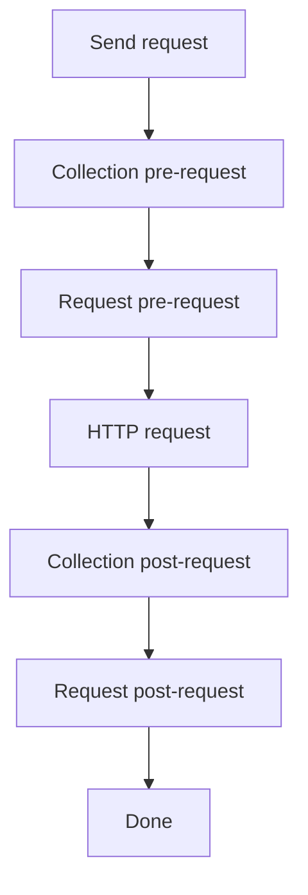

# Request scripts

HarborClient lets you run JavaScript before and after each HTTP request. Scripts run in an isolated sandbox and use the global `hc` object to read and modify the outgoing request, set variables, and assert on the response.


Scripts can be defined at two levels:

- **Collection** — in collection settings, under **Pre-request script** and **Post-request script**. These run for every request in the collection.
- **Request** — in the request editor, under the **Pre** and **Post** tabs. These run only for that saved request.

Both levels use the same `hc` API and the same JavaScript sandbox.

## Execution order

When you send a request, scripts run in this order:

1. Collection pre-request script
2. Request pre-request script
3. HTTP request is sent
4. Collection post-request script
5. Request post-request script

Empty scripts are skipped. Within each phase, variable values set by earlier scripts are available to later scripts and to `{{variable}}` substitution when the request is sent.



## The hc object

All script APIs are exposed on the global `hc` object. The editor provides autocomplete for `hc` members; keep custom snippets aligned with the reference below.

[Plugins](/plugin_development) use the same `hc` name with a broader API for UI contributions, storage, and HTTP hooks. Plugin APIs are not available inside collection or request scripts.

### hc.request

Read and write the outgoing request. Available in both pre- and post-request scripts. Changes made in pre-request scripts affect the request that is sent; changes in post-request scripts do not re-send the request.

#### hc.request.method

**Type:** `string` (get/set)

HTTP method for the request (for example `GET`, `POST`).

```javascript
hc.request.method = 'POST';
```

#### hc.request.url

**Type:** `string` (get/set)

Request URL. Setters coerce the value to a string.

```javascript
hc.request.url = 'https://api.example.com/v1/users';
```

#### hc.request.body

**Type:** `string` (get/set)

Request body as text. Setters coerce the value to a string.

```javascript
hc.request.body = JSON.stringify({ name: 'Ada' });
```

#### hc.request.headers

Header helpers for the request-level header list (not collection-level headers).

##### hc.request.headers.get(key)

**Signature:** `(key: string) => string | undefined`

Returns the value of the first **enabled** header whose name matches `key` case-insensitively. Returns `undefined` if no matching header exists.

```javascript
var auth = hc.request.headers.get('Authorization');
```

##### hc.request.headers.upsert(key, value)

**Signature:** `(key: string, value: string) => void`

Updates the value of an existing enabled header with the same name (case-insensitive), or appends a new enabled header if none exists.

```javascript
hc.request.headers.upsert('Authorization', 'Bearer ' + hc.variables.get('token'));
```

##### hc.request.headers.toObject()

**Signature:** `() => Record<string, string>`

Returns a plain object of all enabled headers with non-empty keys. Header names are preserved as stored; duplicate keys are not merged in the object (last wins depends on iteration order).

```javascript
var headers = hc.request.headers.toObject();
console.log(headers['Content-Type']);
```

### hc.variables

Get and set variables for the current send. Collection variables are loaded at the start of the send; values set with `hc.variables.set` are ephemeral and apply only to the current send (they are not persisted to the collection).

Variables can be referenced elsewhere with `{{key}}` syntax in URLs, headers, params, body, and script source. Script source is substituted **before** each script runs, so a variable set in an earlier script is available to later scripts and to the outgoing request.

#### hc.variables.get(key)

**Signature:** `(key: string) => string | undefined`

Returns the session value set during this send (via `hc.variables.set`) if present; otherwise returns the collection variable value. Returns `undefined` if the key is not set.

```javascript
var token = hc.variables.get('token');
```

#### hc.variables.set(key, value)

**Signature:** `(key: string, value: string) => void`

Sets an ephemeral variable for the remainder of this send. Values are coerced to strings.

```javascript
hc.variables.set('token', 'abc123');
hc.variables.set('timestamp', String(Date.now()));
```

#### hc.variables.replaceIn(template)

**Signature:** `(template: string) => string`

Replaces `{{key}}` placeholders in a string using the same resolution order as send-time substitution: session values set with `hc.variables.set`, then merged runtime variables (collection and environment), then dynamic variables such as `{{$guid}}` and `{{$randomEmail}}`. Unknown tokens are left unchanged. See [Variables](/variables) for the full dynamic variable list.

```javascript
hc.request.url = hc.variables.replaceIn('https://api.example.com/users/{{$guid}}');
console.log(hc.variables.replaceIn('Bearer {{token}}'));
```

### hc.collection.variables

Get and set collection variables for the current send. Values set with `hc.collection.variables.set` are persisted to the collection after the send completes (unlike `hc.variables.set`, which is ephemeral).

Collection variables can be referenced elsewhere with `{{key}}` syntax in URLs, headers, params, body, and script source.

#### hc.collection.variables.get(key)

**Signature:** `(key: string) => string | undefined`

Returns the value set during this send (via `hc.collection.variables.set`) if present; otherwise returns the merged runtime variable value (collection and environment). Returns `undefined` if the key is not set.

```javascript
var token = hc.collection.variables.get('token');
```

#### hc.collection.variables.set(key, value)

**Signature:** `(key: string, value: string) => void`

Sets a collection variable for the remainder of this send and persists it to the collection when the send completes. Values are coerced to strings. New keys are added to the collection with an empty default and `share: false`.

```javascript
hc.collection.variables.set('token', 'abc123');
hc.collection.variables.set('timestamp', String(Date.now()));
```

#### hc.collection.name

**Type:** `string` (read-only)

Display name of the collection the request belongs to. Empty string when the request has no collection.

```javascript
console.log('Collection:', hc.collection.name);
```

#### hc.collection.id

**Type:** `number | null` (read-only)

Storage id of the collection, or `null` when the request has no collection.

```javascript
console.log('Collection id:', hc.collection.id);
```

#### hc.collection.headers

Read and write collection-level headers sent with every request in the collection. Header values support `{{variable}}` syntax. Changes made via `hc.collection.headers.upsert` apply to the current send and are persisted to the collection after the send completes.

Request-level headers override collection headers when both define the same header name (case-insensitive).

##### hc.collection.headers.get(key)

**Signature:** `(key: string) => string | undefined`

Returns the value of the first **enabled** collection header whose name matches `key` case-insensitively. Returns `undefined` if no matching header exists.

```javascript
var auth = hc.collection.headers.get('Authorization');
```

##### hc.collection.headers.upsert(key, value)

**Signature:** `(key: string, value: string) => void`

Updates the value of an existing enabled collection header with the same name (case-insensitive), or appends a new enabled header if none exists. Persisted to the collection when the send completes.

```javascript
hc.collection.headers.upsert('Authorization', 'Bearer ' + hc.collection.variables.get('token'));
```

##### hc.collection.headers.toObject()

**Signature:** `() => Record<string, string>`

Returns a plain object of all enabled collection headers with non-empty keys.

```javascript
var headers = hc.collection.headers.toObject();
console.log(headers['Content-Type']);
```

### hc.globals

Get and set app-wide global variables. Values set with `hc.globals.set` are persisted to **Settings → Globals** after the send completes (unlike `hc.variables.set`, which is ephemeral).

Global variables can be referenced elsewhere with `{{key}}` syntax in URLs, headers, params, body, and script source.

#### hc.globals.get(key)

**Signature:** `(key: string) => string | undefined`

Returns the value set during this send (via `hc.globals.set`) if present; otherwise returns the merged runtime variable value (global, collection, and environment). Returns `undefined` if the key is not set.

```javascript
var baseUrl = hc.globals.get('baseUrl');
```

#### hc.globals.set(key, value)

**Signature:** `(key: string, value: string) => void`

Sets a global variable for the remainder of this send and persists it to app settings when the send completes. Values are coerced to strings. New keys are added with an empty default and `share: false`.

```javascript
hc.globals.set('baseUrl', 'https://api.example.com');
```

### hc.environment

Read and write variables on the active environment. When no environment is selected, `hc.environment.name` is an empty string and variable sets apply to the current send only (they are not persisted).

#### hc.environment.name

**Type:** `string` (read-only)

Display name of the active environment. Empty string when no environment is selected.

```javascript
console.log('Environment:', hc.environment.name);
```

#### hc.environment.variables.get(key)

**Signature:** `(key: string) => string | undefined`

Returns the value set during this send (via `hc.environment.variables.set`) if present; otherwise returns the merged runtime variable value (collection and environment). Returns `undefined` if the key is not set.

```javascript
var token = hc.environment.variables.get('token');
```

#### hc.environment.variables.set(key, value)

**Signature:** `(key: string, value: string) => void`

Sets an environment variable for the remainder of this send and persists it to the active environment when the send completes. Values are coerced to strings. New keys are added to the environment with an empty default and `share: false`. When no environment is active, the value applies to the send only.

```javascript
hc.environment.variables.set('token', 'abc123');
hc.environment.variables.set('timestamp', String(Date.now()));
```

### hc.test(name, fn)

**Signature:** `(name: string, fn: () => void) => void`

Registers a named test. If `fn` completes without throwing, the test passes. If `fn` throws (including failed `hc.expect` assertions), the test fails and the error message is recorded.

Tests are most useful in post-request scripts. Results appear in the response viewer **Tests** tab after the send completes.

```javascript
hc.test('status is 200', function () {
  hc.expect(hc.response.code).to.equal(200);
});
```

### hc.expect(actual)

**Signature:** `(actual: unknown) => Expect`

Returns an assertion helper for use inside `hc.test`. Failed assertions throw an `Error` with a descriptive message.

#### hc.expect(actual).to.equal(expected)

Strict equality (`===`). Use for primitives and reference checks.

```javascript
hc.expect(hc.response.code).to.equal(200);
hc.expect(hc.response.status).to.equal('OK');
```

#### hc.expect(actual).to.eql(expected)

Deep equality via `JSON.stringify` comparison. Use for objects and arrays.

```javascript
hc.expect(hc.response.json()).to.eql({ ok: true });
```

#### hc.expect(actual).to.include(substr)

Asserts that `actual` is a string containing `substr`.

```javascript
hc.expect(hc.response.text()).to.include('"ok":true');
```

#### hc.expect(actual).be.ok()

Asserts that `actual` is truthy.

```javascript
hc.expect(hc.response.headers['content-type']).be.ok();
```

### hc.response

**Available in post-request scripts only.** Not defined during pre-request scripts.

Read-only access to the HTTP response from the send that just completed.

#### hc.response.code

**Type:** `number` (read-only)

HTTP status code (for example `200`, `404`). Maps to the response `status` field.

```javascript
hc.expect(hc.response.code).to.equal(200);
```

#### hc.response.status

**Type:** `string` (read-only)

HTTP status text (for example `OK`, `Not Found`).

```javascript
console.log(hc.response.status);
```

#### hc.response.headers

**Type:** `Record<string, string>` (read-only)

Response headers as a flat key-value map.

```javascript
var contentType = hc.response.headers['content-type'];
```

#### hc.response.responseTime

**Type:** `number` (read-only)

Round-trip time for the request in milliseconds.

```javascript
hc.test('responds quickly', function () {
  hc.expect(hc.response.responseTime < 1000).be.ok();
});
```

#### hc.response.text()

**Signature:** `() => string`

Returns the response body as a string.

```javascript
var body = hc.response.text();
```

#### hc.response.json()

**Signature:** `() => unknown`

Parses the response body as JSON and returns the result. Throws if the body is not valid JSON.

```javascript
var data = hc.response.json();
hc.expect(data.id).be.ok();
```

## console

Scripts can log output with a limited `console` object. Log lines are captured and shown in the send console after the request completes.

### console.log(...args)

**Signature:** `(...args: unknown[]) => void`

Logs one or more values. Non-string arguments are JSON-stringified; arguments are joined with spaces.

```javascript
console.log('token set:', hc.variables.get('token'));
```

### console.error(...args)

**Signature:** `(...args: unknown[]) => void`

Same as `console.log`, but each line is prefixed with `[error]`.

```javascript
console.error('missing token');
```

## What gets applied back

After each script runs, HarborClient applies these changes:

| Change | Applied to sent request | Persists to saved request |
| --- | --- | --- |
| `hc.request.method`, `url`, `body`, `headers` | Yes (pre scripts only) | No |
| `hc.variables.set` | Yes (via `{{key}}` substitution) | No (session only) |
| `hc.collection.variables.set` | Yes (via `{{key}}` substitution) | Yes (collection variables) |
| `hc.collection.headers.upsert` | Yes (collection headers on send) | Yes (collection headers) |
| `hc.environment.variables.set` | Yes (via `{{key}}` substitution) | Yes (active environment variables) |
| `hc.globals.set` | Yes (via `{{key}}` substitution) | Yes (app global variables) |
| `hc.test` results | N/A | Shown in response viewer |
| `console.log` / `console.error` | N/A | Shown in send console |

Request **params** and **body type** are not modified by scripts. Post-request changes to `hc.request` do not trigger a second send.

Variable resolution order for `hc.variables.get`:

1. Value set with `hc.variables.set` during this send
2. Active environment variable value (or default if the value is empty)
3. Collection variable value (or default if the value is empty)
4. Global variable value (or default if the value is empty)

Variable resolution order for `hc.collection.variables.get`:

1. Value set with `hc.collection.variables.set` during this send
2. Merged runtime variable value (global, collection, and environment, same order as above)

Variable resolution order for `hc.environment.variables.get`:

1. Value set with `hc.environment.variables.set` during this send
2. Merged runtime variable value (global, collection, and environment, same order as above)

Variable resolution order for `hc.globals.get`:

1. Value set with `hc.globals.set` during this send
2. Merged runtime variable value (global, collection, and environment, same order as above)

See [Environments](/environments) for how global, collection, and environment variables are merged at send time.

## Sandbox limits

Scripts run inside a `node:vm` sandbox in the main process:

- **Timeout:** 5 seconds per script
- **No I/O:** no network, filesystem, `require`, `import`, or DOM APIs are exposed to the script
- **Language:** modern JavaScript (scripts are transpiled with esbuild before execution). `import`, `require`, and external modules are not supported.
- **Globals:** only `hc`, `console`, and standard JavaScript globals are available

If a script throws or times out, the error is recorded and the send continues with the last known request state. Syntax errors and runtime exceptions surface in the send console.

## Examples

### Pre-request: set URL, header, and token

Runs before the request is sent. Sets the target URL, attaches an auth header, and stores a token for `{{token}}` substitution elsewhere.

```javascript
hc.request.url = 'https://api.example.com/v1/users';
hc.request.method = 'GET';
hc.variables.set('token', 'abc123');
hc.request.headers.upsert('Authorization', 'Bearer ' + hc.variables.get('token'));
console.log('pre-request ran');
```

### Post-request: assert status and JSON body

Runs after the response is received. Registers tests that appear in the **Tests** tab.

```javascript
hc.test('status is 200', function () {
  hc.expect(hc.response.code).to.equal(200);
});

hc.test('body has ok', function () {
  hc.expect(hc.response.json()).to.eql({ ok: true });
});
```

### Chain variables across collection and request scripts

Collection pre-request script:

```javascript
hc.variables.set('baseUrl', 'https://api.example.com');
```

Request pre-request script:

```javascript
hc.request.url = hc.variables.get('baseUrl') + '/v1/status';
```

The request URL becomes `https://api.example.com/v1/status` when sent.

## Migrating from Postman

When you [import a Postman collection](/collections#postman-collections), HarborClient copies pre-request and post-request script text into the collection and request settings **verbatim**. Postman scripts use the global `pm` object; HarborClient scripts use `hc`. There is no `pm` compatibility layer — any `pm.*` reference throws `pm is not defined` at runtime.

After import, open each script and rewrite it against the `hc` API described above. The sections below map common Postman patterns to HarborClient equivalents and call out features that have no direct replacement.

### pm to hc API mapping

| Postman (`pm`) | HarborClient (`hc`) | Notes |
| --- | --- | --- |
| `pm.variables.get(key)` / `pm.variables.set(key, value)` | `hc.variables.get(key)` / `hc.variables.set(key, value)` | Session-only; not persisted after the send |
| `pm.variables.replaceIn(template)` | `hc.variables.replaceIn(template)` | Resolves `{{key}}`, runtime vars, and dynamic `{{$name}}` tokens |
| `pm.environment.get(key)` / `pm.environment.set(key, value)` | `hc.environment.variables.get(key)` / `hc.environment.variables.set(key, value)` | Persists to the active environment when one is selected |
| `pm.collectionVariables.get(key)` / `pm.collectionVariables.set(key, value)` | `hc.collection.variables.get(key)` / `hc.collection.variables.set(key, value)` | Persists to the collection after the send |
| `pm.globals.get(key)` / `pm.globals.set(key, value)` | `hc.globals.get(key)` / `hc.globals.set(key, value)` | Persists to app global variables after the send |
| `postman.setEnvironmentVariable(key, value)` | `hc.environment.variables.set(key, value)` | Legacy Postman alias |
| `postman.setGlobalVariable(key, value)` | `hc.globals.set(key, value)` | Legacy Postman alias; persists to globals after the send |
| `pm.request.method` | `hc.request.method` | Get/set |
| `pm.request.url` | `hc.request.url` | Get/set |
| `pm.request.body` (raw mode) | `hc.request.body` | Get/set as text |
| `pm.request.headers.get(key)` | `hc.request.headers.get(key)` | Case-insensitive |
| `pm.request.headers.add({ key, value })` / `pm.request.headers.upsert({ key, value })` | `hc.request.headers.upsert(key, value)` | HarborClient uses separate key and value arguments |
| `pm.request.headers.toObject()` | `hc.request.headers.toObject()` | Plain object of enabled headers |
| `pm.response.code` | `hc.response.code` | HTTP status code (e.g. `200`) |
| `pm.response.status` | `hc.response.status` | Status text (e.g. `OK`) |
| `pm.response.text()` | `hc.response.text()` | Response body as string |
| `pm.response.json()` | `hc.response.json()` | Parses JSON; throws on invalid JSON |
| `pm.response.responseTime` | `hc.response.responseTime` | Round-trip time in milliseconds |
| `pm.response.headers.get(name)` | `hc.response.headers[name]` | Flat read-only map; use bracket notation, not `.get()` |
| `pm.test(name, fn)` | `hc.test(name, fn)` | Same pattern |
| `pm.expect(actual).to.equal(expected)` | `hc.expect(actual).to.equal(expected)` | Strict equality |
| `pm.expect(actual).to.eql(expected)` | `hc.expect(actual).to.eql(expected)` | Deep equality via JSON comparison |
| `pm.expect(actual).to.include(substr)` | `hc.expect(actual).to.include(substr)` | String contains |
| `pm.expect(actual).to.be.ok` | `hc.expect(actual).be.ok()` | HarborClient uses `.be.ok()` as a method call, not `.to.be.ok` |
| `pm.response.to.have.status(200)` | `hc.expect(hc.response.code).to.equal(200)` | No Chai-style response matchers |

Collection-level headers in Postman are usually set in the collection UI. In HarborClient, use `hc.collection.headers.upsert(key, value)` in a script or configure headers in collection settings. See [hc.collection.headers](#hccollectionheaders) above.

### Not supported

These Postman script features have no HarborClient equivalent:

- **`pm.sendRequest(...)`** — scripts cannot make outbound HTTP requests. The sandbox has no network access; see [Sandbox limits](#sandbox-limits).
- **`require(...)` / bundled libraries** — lodash, crypto-js, cheerio, ajv, and other Postman built-ins are not available.
- **Extended Chai matchers** — `hc.expect` supports only `to.equal`, `to.eql`, `to.include`, and `be.ok()`. Matchers such as `to.be.a`, `to.have.property`, and `pm.response.to.be.ok` must be rewritten.
- **`pm.info`**, **`pm.iterationData`**, **visualizers**, and the legacy **`tests["name"] = true`** global.
- **Request params and body type** — scripts cannot change query params or switch between JSON, form, and multipart body modes; only `hc.request.body` text is writable.

Modern JavaScript syntax (`const`, arrow functions, template literals, optional chaining, and similar) is supported in migrated scripts. `import`, `require`, and bundled libraries remain unavailable; see [Sandbox limits](#sandbox-limits).

### Example: rewrite a Postman test script

Postman post-request script:

```javascript
var jsonData = pm.response.json();
pm.environment.set('token', jsonData.token);

pm.test('Status code is 200', function () {
  pm.response.to.have.status(200);
});

pm.test('Content-Type is JSON', function () {
  pm.expect(pm.response.headers.get('Content-Type')).to.include('application/json');
});
```

Equivalent HarborClient post-request script:

```javascript
var jsonData = hc.response.json();
hc.environment.variables.set('token', jsonData.token);

hc.test('Status code is 200', function () {
  hc.expect(hc.response.code).to.equal(200);
});

hc.test('Content-Type is JSON', function () {
  hc.expect(hc.response.headers['content-type']).to.include('application/json');
});
```

For collection import behavior and other Postman feature gaps, see [Collections — Postman collections](/collections#postman-collections).
