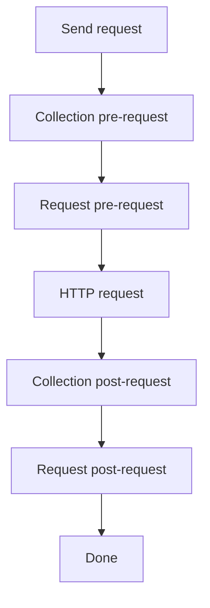

# Request scripts

HarborClient lets you run JavaScript before and after each HTTP request. Scripts run in an isolated sandbox and use the global `hc` object to read and modify the outgoing request, set variables, and assert on the response.

Scripts can be defined at two levels:

- **Collection** — in collection settings, under **Pre-request script** and **Post-request script**. These run for every request in the collection.
- **Request** — in the request editor, under the **Pre** and **Post** tabs. These run only for that saved request.

Both levels use the same `hc` API and the same JavaScript sandbox.

## Execution order

When you send a request, scripts run in this order:

1. Collection pre-request script
2. Request pre-request script
3. HTTP request is sent
4. Collection post-request script
5. Request post-request script

Empty scripts are skipped. Within each phase, variable values set by earlier scripts are available to later scripts and to `{{variable}}` substitution when the request is sent.



## The hc object

All script APIs are exposed on the global `hc` object. The editor provides autocomplete for `hc` members; keep custom snippets aligned with the reference below.

### hc.request

Read and write the outgoing request. Available in both pre- and post-request scripts. Changes made in pre-request scripts affect the request that is sent; changes in post-request scripts do not re-send the request.

#### hc.request.method

**Type:** `string` (get/set)

HTTP method for the request (for example `GET`, `POST`).

```javascript
hc.request.method = 'POST';
```

#### hc.request.url

**Type:** `string` (get/set)

Request URL. Setters coerce the value to a string.

```javascript
hc.request.url = 'https://api.example.com/v1/users';
```

#### hc.request.body

**Type:** `string` (get/set)

Request body as text. Setters coerce the value to a string.

```javascript
hc.request.body = JSON.stringify({ name: 'Ada' });
```

#### hc.request.headers

Header helpers for the request-level header list (not collection-level headers).

##### hc.request.headers.get(key)

**Signature:** `(key: string) => string | undefined`

Returns the value of the first **enabled** header whose name matches `key` case-insensitively. Returns `undefined` if no matching header exists.

```javascript
var auth = hc.request.headers.get('Authorization');
```

##### hc.request.headers.upsert(key, value)

**Signature:** `(key: string, value: string) => void`

Updates the value of an existing enabled header with the same name (case-insensitive), or appends a new enabled header if none exists.

```javascript
hc.request.headers.upsert('Authorization', 'Bearer ' + hc.variables.get('token'));
```

##### hc.request.headers.toObject()

**Signature:** `() => Record<string, string>`

Returns a plain object of all enabled headers with non-empty keys. Header names are preserved as stored; duplicate keys are not merged in the object (last wins depends on iteration order).

```javascript
var headers = hc.request.headers.toObject();
console.log(headers['Content-Type']);
```

### hc.variables

Get and set variables for the current send. Collection variables are loaded at the start of the send; values set with `hc.variables.set` are ephemeral and apply only to the current send (they are not persisted to the collection).

Variables can be referenced elsewhere with `{{key}}` syntax in URLs, headers, params, body, and script source. Script source is substituted **before** each script runs, so a variable set in an earlier script is available to later scripts and to the outgoing request.

#### hc.variables.get(key)

**Signature:** `(key: string) => string | undefined`

Returns the session value set during this send (via `hc.variables.set`) if present; otherwise returns the collection variable value. Returns `undefined` if the key is not set.

```javascript
var token = hc.variables.get('token');
```

#### hc.variables.set(key, value)

**Signature:** `(key: string, value: string) => void`

Sets an ephemeral variable for the remainder of this send. Values are coerced to strings.

```javascript
hc.variables.set('token', 'abc123');
hc.variables.set('timestamp', String(Date.now()));
```

### hc.test(name, fn)

**Signature:** `(name: string, fn: () => void) => void`

Registers a named test. If `fn` completes without throwing, the test passes. If `fn` throws (including failed `hc.expect` assertions), the test fails and the error message is recorded.

Tests are most useful in post-request scripts. Results appear in the response viewer **Tests** tab after the send completes.

```javascript
hc.test('status is 200', function () {
  hc.expect(hc.response.code).to.equal(200);
});
```

### hc.expect(actual)

**Signature:** `(actual: unknown) => Expect`

Returns an assertion helper for use inside `hc.test`. Failed assertions throw an `Error` with a descriptive message.

#### hc.expect(actual).to.equal(expected)

Strict equality (`===`). Use for primitives and reference checks.

```javascript
hc.expect(hc.response.code).to.equal(200);
hc.expect(hc.response.status).to.equal('OK');
```

#### hc.expect(actual).to.eql(expected)

Deep equality via `JSON.stringify` comparison. Use for objects and arrays.

```javascript
hc.expect(hc.response.json()).to.eql({ ok: true });
```

#### hc.expect(actual).to.include(substr)

Asserts that `actual` is a string containing `substr`.

```javascript
hc.expect(hc.response.text()).to.include('"ok":true');
```

#### hc.expect(actual).be.ok()

Asserts that `actual` is truthy.

```javascript
hc.expect(hc.response.headers['content-type']).be.ok();
```

### hc.response

**Available in post-request scripts only.** Not defined during pre-request scripts.

Read-only access to the HTTP response from the send that just completed.

#### hc.response.code

**Type:** `number` (read-only)

HTTP status code (for example `200`, `404`). Maps to the response `status` field.

```javascript
hc.expect(hc.response.code).to.equal(200);
```

#### hc.response.status

**Type:** `string` (read-only)

HTTP status text (for example `OK`, `Not Found`).

```javascript
console.log(hc.response.status);
```

#### hc.response.headers

**Type:** `Record<string, string>` (read-only)

Response headers as a flat key-value map.

```javascript
var contentType = hc.response.headers['content-type'];
```

#### hc.response.responseTime

**Type:** `number` (read-only)

Round-trip time for the request in milliseconds.

```javascript
hc.test('responds quickly', function () {
  hc.expect(hc.response.responseTime < 1000).be.ok();
});
```

#### hc.response.text()

**Signature:** `() => string`

Returns the response body as a string.

```javascript
var body = hc.response.text();
```

#### hc.response.json()

**Signature:** `() => unknown`

Parses the response body as JSON and returns the result. Throws if the body is not valid JSON.

```javascript
var data = hc.response.json();
hc.expect(data.id).be.ok();
```

## console

Scripts can log output with a limited `console` object. Log lines are captured and shown in the send console after the request completes.

### console.log(...args)

**Signature:** `(...args: unknown[]) => void`

Logs one or more values. Non-string arguments are JSON-stringified; arguments are joined with spaces.

```javascript
console.log('token set:', hc.variables.get('token'));
```

### console.error(...args)

**Signature:** `(...args: unknown[]) => void`

Same as `console.log`, but each line is prefixed with `[error]`.

```javascript
console.error('missing token');
```

## What gets applied back

After each script runs, HarborClient applies these changes:

| Change | Applied to sent request | Persists to saved request |
| --- | --- | --- |
| `hc.request.method`, `url`, `body`, `headers` | Yes (pre scripts only) | No |
| `hc.variables.set` | Yes (via `{{key}}` substitution) | No (session only) |
| `hc.test` results | N/A | Shown in response viewer |
| `console.log` / `console.error` | N/A | Shown in send console |

Request **params** and **body type** are not modified by scripts. Post-request changes to `hc.request` do not trigger a second send.

Variable resolution order for `hc.variables.get`:

1. Value set with `hc.variables.set` during this send
2. Collection variable value (or default if the value is empty)

## Sandbox limits

Scripts run inside an [isolated-vm](https://github.com/laverdet/isolated-vm) sandbox in the main process:

- **Timeout:** 5 seconds per script
- **Memory:** 128 MB per isolate
- **No I/O:** no network, filesystem, `require`, `import`, or DOM APIs
- **Language:** plain JavaScript (ES5-style syntax such as `var` and `function` works reliably; modern syntax may not)
- **Globals:** only `hc`, `console`, and standard sandbox globals are available

If a script throws or times out, the error is recorded and the send continues with the last known request state. Syntax errors and runtime exceptions surface in the send console.

## Examples

### Pre-request: set URL, header, and token

Runs before the request is sent. Sets the target URL, attaches an auth header, and stores a token for `{{token}}` substitution elsewhere.

```javascript
hc.request.url = 'https://api.example.com/v1/users';
hc.request.method = 'GET';
hc.variables.set('token', 'abc123');
hc.request.headers.upsert('Authorization', 'Bearer ' + hc.variables.get('token'));
console.log('pre-request ran');
```

### Post-request: assert status and JSON body

Runs after the response is received. Registers tests that appear in the **Tests** tab.

```javascript
hc.test('status is 200', function () {
  hc.expect(hc.response.code).to.equal(200);
});

hc.test('body has ok', function () {
  hc.expect(hc.response.json()).to.eql({ ok: true });
});
```

### Chain variables across collection and request scripts

Collection pre-request script:

```javascript
hc.variables.set('baseUrl', 'https://api.example.com');
```

Request pre-request script:

```javascript
hc.request.url = hc.variables.get('baseUrl') + '/v1/status';
```

The request URL becomes `https://api.example.com/v1/status` when sent.
