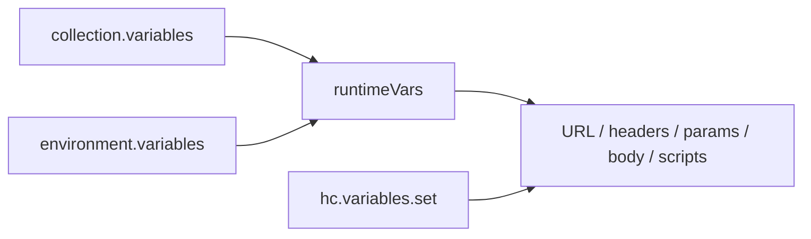
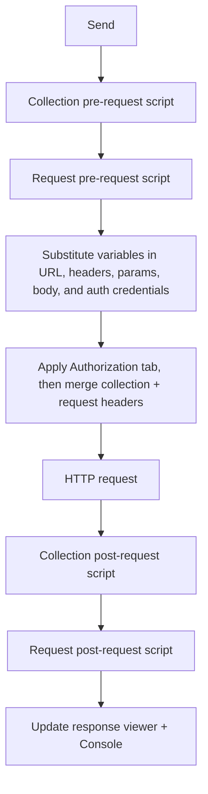

# Making requests

HarborClient is built around the request editor: you compose an HTTP request, send it, and inspect the response. The main window is split into a sidebar (collections and environments), a TabBar across the top, the request editor in the middle, and the response panel below. An optional Console slides up from the footer to log every send in the current session.

Each open tab holds one editable request draft and, after you send, the response for that tab. Only the **active** tab's response is shown in the response panel.


## The request editor

The request editor is where you build a request before sending it.

### Request name

Click the request name to edit it inline. When the request belongs to a collection, the name shows as a breadcrumb: `CollectionName > Request name`. New tabs default to **Untitled Request**. Press Enter or Escape to finish editing the name.

### Method, URL, and Send

- **Method** — Choose from GET, POST, PUT, PATCH, DELETE, HEAD, or OPTIONS.
- **URL** — Enter the request URL. Supports `{{variable}}` placeholders (see [Variables in requests](#variables-in-requests)). Press **Enter** in the URL field to send the request.
- **Send** — Click **Send** to dispatch the request. The button shows **Sending…** and is disabled while the request is in flight.

### Editor tabs

Below the URL bar, tabs configure the request:

| Tab | Purpose |
| --- | --- |
| **Params** | Query string parameters |
| **Headers** | Request-level headers |
| **Authorization** | Basic Auth or Bearer Token for the outgoing request |
| **Cookies** | Read-only view of cookies for the request URL (from the cookie jar) |
| **Body** | Request body (hidden for GET and HEAD) |
| **PreRequest** | JavaScript to run before the request is sent |
| **PostRequest** | JavaScript to run after the response is received |
| **Comment** | Free-form notes (not sent with the request) |

## Query parameters

The **Params** tab uses a key-value editor. Each row has an enable checkbox, a key, and a value.

- Enabled rows with a non-empty key are appended to the URL at send time.
- If the URL already contains a parameter with the same name, the Params tab value **overwrites** it.
- A blank row is added automatically when you fill in the last row's key.
- Uncheck a row's enable box to exclude it from the send without deleting it.
- Values support `{{variable}}` substitution.

Example: URL `https://api.example.com/search` plus param `q` = `{{query}}` becomes `https://api.example.com/search?q=hello` when `query` resolves to `hello`.

## Headers

### Request headers

The **Headers** tab uses the same key-value editor as Params. Add headers such as `Authorization`, `Accept`, or custom API keys. Disabled rows and rows with blank keys are excluded at send time. Header values support `{{variable}}` substitution.

Example:

| Header | Value |
| --- | --- |
| Authorization | `Bearer {{token}}` |
| Accept | application/json |

### Collection headers

Every collection can define headers in **Collection Settings → Headers**. These headers are sent with **every request** in that collection.

**Merge rule:** collection headers are applied first, then request headers. If both define the same header name (case-insensitive), the **request-level header wins**.

Open Collection Settings by double-clicking a collection in the sidebar, or choose **Settings** from the collection row menu.

## Authorization

The **Authorization** tab configures how HarborClient adds an `Authorization` header at send time. The left pane selects an **Auth Type**; the right pane shows credential fields for the selected type.

| Auth Type | Fields |
| --- | --- |
| **None** | No request-level authorization — collection authorization still applies when configured |
| **Basic Auth** | Username and password |
| **Bearer Token** | Token value |

All credential fields support `{{variable}}` substitution. HarborClient resolves variables, then generates the header value (`Basic …` or `Bearer …`) immediately before the HTTP request is sent.

### Precedence

HarborClient applies authorization in this order:

1. **Manual `Authorization` header** — a non-empty, enabled `Authorization` row in the **Headers** tab, or one set by a pre-request script via `hc.request.headers`, always wins. HarborClient does not overwrite it with the Authorization tab.
2. **Request Authorization tab** — when Auth Type is **Basic Auth** or **Bearer Token**, the request's credentials are used.
3. **Collection Authorization** — when the request Auth Type is **None**, HarborClient uses the collection's Authorization tab settings from [Collection Settings](/collections#authorization).

Collection-level authorization is configured in **Collection Settings → Authorization**. See [Collections — Authorization](/collections#authorization).

### Alternatives

You can still authenticate with a manual header or script when you need full control:

| Header | Value |
| --- | --- |
| Authorization | `Bearer {{token}}` |

```javascript
hc.request.headers.upsert('Authorization', 'Bearer ' + hc.variables.get('token'));
```

See [Request scripts](/request-scripts) for the full `hc.request.headers` API.

## Request body

The **Body** tab is available for all methods except GET and HEAD. Choose a body type from the dropdown:

| Body type | Behavior |
| --- | --- |
| **None** | No body is sent |
| **JSON** | JSON code editor; HarborClient sets `Content-Type: application/json` automatically unless you already set `Content-Type` |
| **Text** | Plain text editor; HarborClient sets `Content-Type: text/plain` automatically unless you already set `Content-Type` |
| **Multipart Form** | Key/value rows where each field is **Text** or **File**; file fields support one or more uploads via a native file picker. HarborClient builds `multipart/form-data` at send time and lets the HTTP client set the boundary automatically. Any user-defined `Content-Type` header is ignored for this body type. |
| **Form URL Encoded** | Key/value rows using the same editor as Params and Headers; HarborClient encodes enabled rows as `application/x-www-form-urlencoded` at send time and sets `Content-Type: application/x-www-form-urlencoded` automatically unless you already set `Content-Type` |

Body text supports `{{variable}}` substitution. For multipart and urlencoded requests, substitution runs over the stored JSON body, so placeholders in field values are resolved at send time. Multipart file paths are stored as absolute paths and are machine-specific.

Example multipart fields:

| Key | Type | Value |
| --- | --- | --- |
| name | Text | `{{userName}}` |
| avatar | File | profile.png (chosen via file picker) |

GET and HEAD requests never send a body, even if the Body tab has content.

Example JSON body:

```json
{
  "name": "{{userName}}",
  "email": "ada@example.com"
}
```

## Variables in requests

Use `{{key}}` syntax (whitespace inside the braces is allowed) anywhere HarborClient substitutes values at send time:

- Request URL
- Header values
- Query parameter values
- Authorization credentials (Basic Auth username/password, Bearer token)
- Request body
- Pre- and post-request script source

### Where variables come from

HarborClient resolves variables in this order:

1. **Collection variables** — defined in Collection Settings → Variables
2. **Environment variables** — from the active environment (environment wins when both define the same key)
3. **`hc.variables.set()`** — set in pre- or post-request scripts during the current send (overrides both for the remainder of that send)

If a variable's **Value** field is empty, HarborClient uses its **Default** instead.



In the editor, placeholders appear literally as `{{token}}`. Hover a placeholder to see the resolved value or **Not defined**. Click **Edit value** in the tooltip to open collection settings for the active collection.

For full details on managing environments and variables, see [Environments](/environments). For setting variables from scripts, see [Request scripts](/request-scripts).

## Collection context

When you send a request, HarborClient uses collection-level settings from:

- The collection the saved request belongs to, or
- The collection currently selected in the sidebar (for unsaved tabs)

Each collection provides:

- **Variables** — available to all requests in the collection
- **Headers** — merged with request headers (request wins on duplicates)
- **Authorization** — default Basic Auth or Bearer Token when the request Auth Type is **None**
- **Pre-request and post-request scripts** — run before and after every request in the collection

Request-level scripts in the **PreRequest** and **PostRequest** tabs run in addition to collection scripts. See [Scripts at a glance](#scripts-at-a-glance) for execution order.

Saving a request requires a collection. Use **File → Save Request** or **Cmd/Ctrl+S** — if no collection is selected, HarborClient prompts you to pick or create one.

For sidebar management, settings, and import/export, see [Collections](/collections). You can also import a single request export via **File → Import** when a collection is selected in the sidebar.

## Scripts at a glance

HarborClient can run JavaScript before and after each send. Scripts use the global `hc` object to modify the outgoing request, set variables, and assert on responses.

| Level | Where to edit |
| --- | --- |
| Collection | Collection Settings → PreRequest / PostRequest |
| Request | Request editor → PreRequest / PostRequest tabs |

Authorization is configured separately on the **Authorization** tab at the collection and request level (not in scripts), though scripts can still set or override headers manually.

When you send a request, scripts run in this order:



- Post-request **tests** (`hc.test`) appear in the response **Tests** tab.
- Script `console.log` output and errors appear in the Console.
- Scripts **cannot** change query parameters or body type.
- Post-request changes to `hc.request` do not trigger a second send.

For the full `hc` API, sandbox limits, and examples, see [Request scripts](/request-scripts).

## Sending a request

You can send a request in two ways:

1. Click the **Send** button
2. Press **Enter** while the URL field is focused

There is no global keyboard shortcut (such as Cmd/Ctrl+Enter) for Send.

### What happens when you send

HarborClient runs collection and request pre-request scripts, substitutes `{{variable}}` placeholders (including authorization credentials), generates an `Authorization` header when configured, merges collection and request headers, sends the HTTP request, then runs collection and request post-request scripts. The response viewer and Console update when the send completes.

### Errors

| Condition | Result |
| --- | --- |
| Blank URL | Status **0**, error **URL is required** — no network call is made |
| Network failure | Status **0**, error message shown — round-trip time is still recorded |
| Script failure | Error toast and Console entry — the send continues with the last known request state |

## Reading the response

The response panel below the request editor shows the result of the last send for the active tab.

### Before a response

- **Sending request…** — shown while a request is in flight
- **Send a request to see the response** — shown before the first send on a tab

### Response header bar

After a send, the top line shows:

- A colored status dot and HTTP status (for example **200 OK**), or **Error** when the send failed
- Round-trip **time** in milliseconds
- Response **size**

If the send failed, a red error banner displays the error message below the header bar.

### Response tabs

| Tab | Content |
| --- | --- |
| **Body** | Read-only response body. JSON is pretty-printed when the Content-Type indicates JSON or the body looks like JSON |
| **Headers** | Response headers as a key-value grid |
| **Redirects** | Appears when the request followed one or more redirects. Lists each hop (method, status, source URL, and `Location` target) plus the final destination. Redirect following is controlled by **Settings → General → Follow redirects** |
| **Tests** | Appears when post-request scripts registered tests. Shows pass/fail counts and error messages |

Responses are **not** restored after you restart the app. Open tabs and their drafts persist, but you need to send again to see a response.

## Console

The Console is a session log of every request you send. Toggle it from the footer. Drag the top edge to resize it.

Each entry shows the method, URL, status, time, size, timestamp, and request or collection name. Entries are listed newest first. Expand an entry to inspect:

- Script errors
- `console.log` and `console.error` output from scripts
- Test pass/fail results
- Full request and response details (General, Request Headers, Payload, Response Body)

Click **Clear** to remove all entries. The Console is session-only — it does not persist across app restarts.

## Tabs, collections, and saving

### Tabs

- Open multiple requests in tabs at once. Each tab shows a method badge, request name, and a **dirty dot** when there are unsaved changes.
- Click **+** on the TabBar or choose **File → New Request** (**Cmd/Ctrl+N**) to open a blank tab.
- Click a saved request in the sidebar to open it in a tab. If the request is already open, HarborClient focuses that tab.
- Close a tab with the **×** button. If the tab has unsaved changes, HarborClient prompts before closing. Closing the last tab opens a new empty tab.

### Saving

- **File → Save Request** or **Cmd/Ctrl+S** saves the active tab's request to a collection.
- If the request already exists in the collection, HarborClient updates it. Otherwise it creates a new saved request.
- Empty key/value rows in params and headers are stripped on save.
- A success toast confirms **Request saved**.

To create a request directly in a collection, use **New Request** from the collection row menu in the sidebar. HarborClient saves an **Untitled Request** and opens it in a new tab.

### Environment selector

The environment dropdown on the far right of the TabBar selects the active environment for **all tabs**. Choose **No Environment** to clear the selection. The active environment persists across app restarts. See [Environments](/environments) for managing environment variables.

## Keyboard shortcuts

| Action | Shortcut |
| --- | --- |
| Send (when URL field is focused) | Enter |
| New request | Cmd/Ctrl+N (default; customizable in Settings → Shortcuts) |
| Save request | Cmd/Ctrl+S (default; customizable in Settings → Shortcuts) |
| New collection | Cmd/Ctrl+Shift+N (default; customizable in Settings → Shortcuts) |
| Settings | Cmd/Ctrl+, (default; customizable in Settings → Shortcuts) |

Edit and View menu shortcuts (undo, copy, paste, zoom, full screen, and others) can also be changed under **Settings → Shortcuts**.

## Limitations

HarborClient does not currently support:

- OAuth or other interactive authentication flows
- Persisted request history beyond the session Console
- Changing query parameters or body type from scripts

GET and HEAD requests never include a request body.

## What's next

- [Environments](/environments) — create and switch between variable groups
- [Request scripts](/request-scripts) — full `hc` API reference, tests, and sandbox limits
- [Features](/features) — overview of collections, tabs, and local storage
