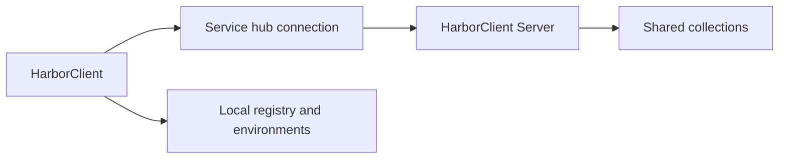

# Service hubs

Service hubs connect HarborClient to a running **[HarborClient Server](https://github.com/harbor/harborclient-server)** instance — a companion HTTP API that stores shared collections for your team. Each hub is a named connection with a base URL and bearer API token. Collections you store on a hub live on the server; HarborClient syncs them into the sidebar and routes create, read, update, and delete operations through the server API.

**Environments are not shared via service hubs.** Environment variable groups stay in your local registry on each machine, even though HarborClient Server supports environments on the server. Use [Environments](/environments) for per-machine variable groups; use service hubs when you want teammates to share the same collection data.

## Prerequisites

Before adding a service hub in HarborClient, you need:

| Requirement | Description |
| --- | --- |
| **HarborClient Server** | A running server instance your team can reach over the network. See the [HarborClient Server repository](https://github.com/harbor/harborclient-server) for setup and deployment. |
| **Service hub URL** | The server base URL (for example `http://127.0.0.1:8788` or `https://api.example.com`). HarborClient strips trailing slashes when saving. |
| **API token** | A bearer token prefixed with `hbk_` that authorizes your HarborClient instance against protected server routes. Obtain or create tokens according to your server's documentation. |

HarborClient verifies connectivity when a hub is saved or mounted at launch. If the server is unreachable or the token is invalid, the hub is skipped and a warning is logged — other providers continue to work.

## Managing service hubs

Open **File → Service Hubs** to manage hub connections. The page lists every configured hub with its display name and URL.

### Add a service hub

| Step | Action |
| --- | --- |
| 1 | Click **Add service hub** |
| 2 | Enter a **Name** (shown in provider dropdowns and sidebar badges) |
| 3 | Enter the **Service hub URL** |
| 4 | Enter the **API token** |
| 5 | Click **Save** |

On success, HarborClient shows **Service hub saved.**, mounts the hub, and runs an additive sync so collections already on the server appear in the sidebar.

### Edit a service hub

Click **Edit** on a hub row, change any field, and click **Save**. HarborClient remounts the hub with the updated URL or token and syncs collections again.

### Delete a service hub

Click **Delete** on a hub row and confirm. Deleting a hub:

- Removes the hub connection from HarborClient
- Removes sidebar registry entries for collections that belonged to that hub
- Deletes the local id-map file HarborClient used to translate server UUIDs to numeric ids

Deleting a hub does **not** delete collections on HarborClient Server itself — teammates who still have access can continue to use server-side data. Your local sidebar entries for that hub are removed.

## Collections on a service hub

HarborClient treats database connections and service hubs as **providers** — places where collection data can live.

### Choosing a provider

When you create or move a collection, pick the provider that should store its data:

| Location | How |
| --- | --- |
| **Create new collection** | Sidebar **+** or **File → New Collection** → **Add collection** → **Create new** → choose **Provider** |
| **Move an existing collection** | **Collection Settings → General → Provider** → **Save** |

The provider dropdown lists SQLite, Firestore, MySQL, PostgreSQL, and any configured service hubs. Service hubs are labeled **(Service Hub)**.

The **active database** (set in [Settings → Databases](/settings#databases)) is the default provider for new collections when you do not choose another one.

### Auto-sync

HarborClient syncs collections from each reachable hub:

- **On app launch** — after hubs are mounted, new server collections are added to the sidebar
- **When you save a hub** — immediately after add or edit

Sync is **additive**: collections on the server that are not yet in your sidebar are registered automatically. HarborClient does **not** remove sidebar entries when a server collection is temporarily missing (for example, while the server is offline). You may see a warning instead.

There is **no background polling** or live sync. Changes made by teammates appear when HarborClient reloads data — for example, after restarting the app or when a hub is saved again.

### Sidebar badges

When a collection's provider is not your active database, its row shows a connection badge with the provider name (database or service hub). This helps distinguish local collections from hub-backed or shared remote-database collections.

## Moving and deleting collections

### Move a collection off a hub

In **Collection Settings → General**, change **Provider** to a database (or another hub) and click **Save**. HarborClient copies the collection's folders and requests to the target provider and updates the sidebar entry.

When the source is a service hub, HarborClient **leaves the original collection on the server**. Teammates keep access to the server copy. HarborClient records the collection as **detached** from that hub so a later sync does not re-add it to your sidebar.

When the source is a local or remote **database**, HarborClient deletes the source copy after a successful move, as before.

### Move a collection onto a hub

Choose a service hub as the target **Provider** and save. HarborClient creates the collection on the server via the API and removes the source copy from the previous database provider (standard move behavior).

### Delete a hub-backed collection

Choose **Delete** from the collection row menu. When the collection is stored on a service hub, HarborClient asks you to confirm that **team members will lose access** to the collection on the server. Confirming deletes the collection on HarborClient Server and removes it from your sidebar.

Deleting a collection from a SQLite or remote-database provider does not show this team-access warning — only hub-backed collections affect shared server data.

## Service hubs vs other sharing options

HarborClient offers several ways to work with others. Pick the approach that matches how your team operates:

| Approach | Best for |
| --- | --- |
| **SQLite / local DB** | Solo work, offline-first, full control on one machine |
| **Remote DB** (Firestore, MySQL, Postgres) | Team shares one database directly; configure connections in [Settings → Databases](/settings#databases) |
| **Encrypted invites** | One-step handoff of database credentials plus a collection; requires [Certificates](/certificates) and [Collections → Sharing](/collections#sharing-collections) |
| **Service hubs** | Team shares collections through HarborClient Server with token-based access — no manual database setup per teammate |

**Remote database vs service hub:** With a remote database, every teammate configures the same DB connection (or accepts an invite that embeds credentials). With a service hub, teammates only need the server URL and their own API token; collection data is exposed through HarborClient Server's HTTP API.

**Invites vs service hubs:** Invites bundle remote **database** connection details and a single collection mapping. Service hubs are a separate path: collections live on the server, and sync discovers collections your token can access. The **Invite** row menu action is intended for remote-database sharing; for hub-backed collections, sharing is handled by granting server access (tokens) rather than sending an invite token.

## Limitations

| Topic | Behavior |
| --- | --- |
| **Live sync** | No background polling. Reload data by restarting the app or saving a hub again. |
| **Environments** | Not shared via hubs. Each HarborClient instance keeps its own environment list locally. |
| **Concurrent edits** | Last write wins through the server API. HarborClient does not merge conflicting edits. |
| **Offline server** | Hub-backed collections may show warnings if the server is unreachable; sidebar entries are not auto-deleted. |
| **Configuration location** | Service hubs are managed under **File → Service Hubs**, not under [Settings → Databases](/settings#databases). |

## What's next

- [Collections](/collections) — sidebar, settings, import/export, and provider moves
- [Settings → Databases](/settings#databases) — SQLite and remote database connections
- [Certificates](/certificates) — keys and trusted collaborators for encrypted invites
- [Environments](/environments) — local variable groups that override collection variables at send time
