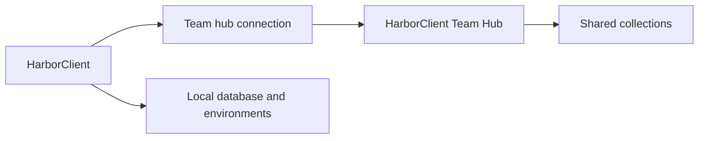

# Team hubs

Team hubs connect HarborClient to a running **[HarborClient Team Hub](https://github.com/harborclient/team-hub)** instance — a self-hosted central server that stores shared collections for your team. Each hub is a named connection with a base URL and bearer API token. Collections you store on a hub live on the team hub; HarborClient syncs them into the sidebar and routes create, read, update, and delete operations through its HTTP API.


**Environments are not shared via team hubs.** Environment variable groups stay in your local database on each machine, even though HarborClient Team Hub supports environments on the server. Use [Environments](/environments) for per-machine variable groups; use team hubs when you want teammates to share the same collection data.



## Prerequisites

Before adding a team hub in HarborClient, you need:

| Requirement               | Description                                                                                                                                                                                                                                         |
| ------------------------- | --------------------------------------------------------------------------------------------------------------------------------------------------------------------------------------------------------------------------------------------------- |
| **HarborClient Team Hub** | A running team hub instance your team can reach over the network. See the [HarborClient Team Hub repository](https://github.com/harborclient/team-hub) and [full documentation](https://harborclient.github.io/team-hub/) for setup and deployment. |
| **Team hub URL**          | The team hub base URL (for example `http://127.0.0.1:8788` or `https://api.example.com`). HarborClient strips trailing slashes when saving.                                                                                                         |
| **API token**             | A bearer token prefixed with `hbk_` that authorizes your HarborClient instance against protected API routes. Obtain or create tokens according to your team hub's documentation.                                                                    |

Each token belongs to a Team Hub account with a **role** that determines what HarborClient can do with that connection:

| Token role         | HarborClient behavior                                                    |
| ------------------ | ------------------------------------------------------------------------ |
| **user** (default) | Syncs collections; no admin management actions on the hub row            |
| **admin**          | Shows **Manage users**, **Manage tokens**, and **Reload** on the hub row; does **not** sync collections (management-only) |

HarborClient verifies connectivity when a hub is saved or mounted at launch. If the team hub is unreachable or the token is invalid, the hub is skipped and a warning is logged — other providers continue to work.

## Managing team hubs

Open **File → Team Hub** to manage hub connections. The page lists every configured hub with its display name, URL, and service badges.

Each hub row shows service badges indicating what the hub server provides for that connection. **Storage**, **LLM**, and **Plugin catalog** appear on every row; active badges use green styling and unavailable services appear muted. An **Admin** badge appears only on connections that use an admin token. HarborClient probes the hub after the list loads, so badges may appear muted briefly while scanning.

| Badge              | Shown when | Active when                                                                 |
| ------------------ | ---------- | --------------------------------------------------------------------------- |
| **Storage**        | Always     | The hub is reachable and exposes collection storage                         |
| **LLM**            | Always     | The hub has LLM proxy support configured in `server.yaml`                   |
| **Plugin catalog** | Always     | The hub publishes plugin marketplace or trusted-publisher URLs              |
| **Admin**          | Admin token connections only | This connection uses an admin token with management API access |

### Add a team hub

| Step | Action                                                            |
| ---- | ----------------------------------------------------------------- |
| 1    | Click **Add team hub**                                            |
| 2    | Enter a **Name** (shown in provider dropdowns and sidebar badges) |
| 3    | Enter the **Team hub URL**                                        |
| 4    | Enter the **API token**                                           |
| 5    | Click **Save**                                                    |

On success, HarborClient shows a **Team hub saved.** toast, mounts the hub, and runs an additive sync so collections already on the team hub appear in the sidebar.

### Edit a team hub

Click **Edit** on a hub row, change any field, and click **Save**. HarborClient remounts the hub with the updated URL or token and syncs collections again.

### Delete a team hub

Click **Delete** on a hub row and confirm. Deleting a hub:

- Removes the hub connection from HarborClient
- Removes sidebar registry entries for collections that belonged to that hub
- Deletes the local id-map file HarborClient used to translate server UUIDs to numeric ids

Deleting a hub does **not** delete collections on HarborClient Team Hub itself — teammates who still have access can continue to use server-side data. Your local sidebar entries for that hub are removed.

## Admin tokens

An **admin token** is an `hbk_` bearer token issued for a Team Hub account with `role: admin`. It authorizes the management API — user accounts, roles, and access settings — not collection data.

Admin tokens are created on the Team Hub server, not in HarborClient. After your team hub is running and migrated, an operator can create an admin account and token from the server CLI:

```bash
team-hub user create --name ops --role admin
team-hub user token create --user <user-id> --name "Ops laptop"
```

See the Team Hub [authentication documentation](https://harborclient.github.io/team-hub/auth.html) for the full CLI workflow, including additional tokens and revocation.

### Add an admin token in HarborClient

Admin tokens use the same **API token** field as regular hub connections — there is no separate admin setting.

| Step | Action                                                                           |
| ---- | -------------------------------------------------------------------------------- |
| 1    | Open **File → Team Hub**                                                         |
| 2    | Click **Add team hub** (or **Edit** an existing hub)                             |
| 3    | Enter a **Name**, **Team hub URL**, and paste the admin token into **API token** |
| 4    | Click **Save**                                                                   |

After save, HarborClient probes each hub. Admin-token connections show row actions for team administration:

- **Manage users** — list, create, edit, and delete user accounts on that hub
- **Manage tokens** — list, create, and delete API bearer tokens for users on that hub
- **Manage collections** — list hub collections, delete them on the server, and mark collections as protected from user deletion
- **Reload** — re-read `server.yaml` on the hub server (see [Reload hub config](#reload-hub-config))

The **Admin** service badge appears on the same connections. User-token rows do not show these actions.

### Reload hub config

Admin-token connections show a **Reload** button on the hub row. Click it to call `POST /admin/config/reload` on the Team Hub server, which re-reads `server.yaml` and applies reloadable sections (database, Redis, LLM, plugins, and server settings).

HarborClient refreshes cached plugin sources and re-scans service badges after a successful reload. If the config file cannot be parsed or individual sections fail, HarborClient shows an error dialog with the server report.

### Admin tokens and collections

Admin tokens cannot read or write collection data through HarborClient. The team hub API returns an empty collection list for admin tokens by design so the connection can still mount without errors.

**Recommended pattern:** configure one hub connection with a **user** token for daily work (collections and requests) and a separate connection with an **admin** token for team administration. You can also keep an admin connection and use it only when managing users.

## Managing team users

Admin-token hub rows include **Manage users**. Click it to list, edit, and delete user accounts on that Team Hub connection. The page title and view header show the hub name and URL so it is clear which server you are managing.


| Step | Action                                                        |
| ---- | ------------------------------------------------------------- |
| 1    | Open **File → Team Hub**                                      |
| 2    | Click **Manage users** on the target admin hub row            |
| 3    | Review the user list (name, role badge, account id)         |

Click **Back** to return to the hub connection list.

Use **Manage tokens** on the same row to create or revoke API bearer tokens for users on that hub.

Use **Manage collections** on the same row to list collections on the hub, delete them on the server, or toggle **Protect from user deletion** so non-admin users can only remove the collection from their own sidebar.

### Manage collections

Admin-token hub rows include **Manage collections**. Click it to list every collection on that Team Hub connection.

| Action | Behavior |
| ------ | -------- |
| **Protect from user deletion** | When enabled, user-token deletes remove the collection from that user's sidebar only; the server copy stays available to teammates |
| **Delete** | Permanently deletes the collection on the team hub (type `DELETE` to confirm) |

Click **Back** to return to the hub connection list.

### Edit a user

Click **Edit** on a user row to open the edit dialog. Available fields:

| Field                       | Notes                                                                  |
| --------------------------- | ---------------------------------------------------------------------- |
| **Name**                    | Display name on the server                                             |
| **Role**                    | `user` or `admin`                                                      |
| **Collection access**       | `*` or comma-separated collection UUIDs (hidden when role is `admin`)  |
| **Environment access**      | `*` or comma-separated environment UUIDs (hidden when role is `admin`) |
| **LLM access**              | Checkbox — enable hub-provided AI models for this account              |
| **LLM models**              | `*` or comma-separated model ids                                       |
| **LLM monthly token limit** | Blank = unlimited                                                      |

Click **Save** to apply changes. HarborClient shows **User updated.** on success.

When you change a user's role to **admin**, collection and environment access fields are cleared on the server — admin accounts manage the hub but do not access entity data through the data API.

### Delete a user

Click **Delete** on a user row. Type `DELETE` in the confirmation field and click **Delete** again. This permanently removes the account and revokes all of its API tokens. HarborClient shows **User deleted.** on success.

### Create users

HarborClient does not create user accounts. Operators create them on the Team Hub server:

```bash
team-hub user create --name alice --role user
team-hub user token create --user <user-id> --name "Alice laptop"
```

Teammates then add their **user** token in HarborClient as described in [Add a team hub](#add-a-team-hub).

## Collections on a team hub

HarborClient treats storage connections and team hubs as **providers** — places where collection data can live.

### Choosing a provider

When you create or move a collection, pick the provider that should store its data:

| Location                        | How                                                                                                    |
| ------------------------------- | ------------------------------------------------------------------------------------------------------ |
| **Create new collection**       | Sidebar **+** or **File → New Collection** → **Add collection** → **Create new** → choose **Provider** |
| **Move an existing collection** | **Collection Settings → General → Provider** → **Save**                                                |

The provider dropdown lists SQLite, Firestore, MySQL, PostgreSQL, and configured **user-token** team hubs. Team hubs are labeled **(Team Hub)**. Admin-token team hub connections are for Team Hub management only (**File → Team Hub**) and do not appear in collection provider dropdowns because they cannot store collection data.

The **active storage location** (set in [Settings → Storage Locations](/settings#storage-locations)) is the default provider for new collections when you do not choose another one.

### Auto-sync

HarborClient syncs collections from each reachable hub:

- **On app launch** — after hubs are mounted, new team hub collections are added to the sidebar
- **When you save a hub** — immediately after add or edit

Sync is **additive**: collections on the team hub that are not yet in your sidebar are registered automatically. When the hub is **reachable**, collections deleted on the server are removed from your sidebar on the next sync (app launch, hub save, or manual storage sync). When the hub is **offline or unreachable**, existing sidebar entries are kept until the hub can be contacted again.

There is **no background polling** or live sync. Changes made by teammates appear when HarborClient reloads data — for example, after restarting the app or when a hub is saved again.

### Sidebar badges

When a collection's provider is not your active storage location, its row shows a connection badge with the provider name (database or team hub). This helps distinguish local collections from hub-backed or shared remote-storage collections.

## Moving and deleting collections

### Move a collection off a hub

In **Collection Settings → General**, change **Provider** to a database (or another hub) and click **Save**. HarborClient copies the collection's folders and requests to the target provider and updates the sidebar entry.

When the source is a team hub, HarborClient **leaves the original collection on HarborClient Team Hub**. Teammates keep access to the server copy. HarborClient records the collection as **detached** from that hub so a later sync does not re-add it to your sidebar.

When the source is a local or remote **storage location**, HarborClient deletes the source copy after a successful move, as before.

### Move a collection onto a hub

Choose a team hub as the target **Provider** and save. HarborClient creates the collection on the team hub via the API and removes the source copy from the previous storage provider (standard move behavior).

### Delete a hub-backed collection

Choose **Delete** from the collection row menu.

| Collection state | What happens |
| ---------------- | ------------ |
| **Not protected, and you created the collection** | HarborClient asks you to confirm that team members will lose access on the team hub. Confirming deletes the collection on HarborClient Team Hub and removes it from your sidebar. |
| **Protected from user deletion** | HarborClient asks whether to remove the collection from your sidebar only. Confirming removes it locally; the collection stays on the team hub for other members and will not reappear in your sidebar after sync. |
| **You did not create the collection** (and it is not protected) | HarborClient removes the collection from your sidebar only; the server copy remains for the creator and other members. |

Administrators enable protection under **File → Team Hub → Manage collections** on an admin-token connection.

Deleting a collection from a SQLite or remote-storage provider does not show the team-hub warnings — only hub-backed collections affect shared server data.

## Team hubs vs other sharing options

HarborClient offers several ways to work with others. Pick the approach that matches how your team operates:

| Approach                                        | Best for                                                                                                                                                        |
| ----------------------------------------------- | --------------------------------------------------------------------------------------------------------------------------------------------------------------- |
| **SQLite / local DB**                           | Solo work, offline-first, full control on one machine                                                                                                           |
| **Remote storage** (Firestore, MySQL, Postgres) | Team shares one storage location directly; configure connections in [Settings → Storage Locations](/settings#storage-locations)                                 |
| **Encrypted sharing**                           | One-step handoff of storage credentials plus a collection; requires [Sharing Keys](/sharing-keys) and [Collections → Sharing](/collections#sharing-collections) |
| **Team hubs**                                   | Team shares collections through HarborClient Team Hub with token-based access — no manual storage setup per teammate                                            |

**Remote storage location vs team hub:** With a remote storage location, every teammate configures the same DB connection (or joins with a share token that embeds credentials). With a team hub, teammates only need the team hub URL and their own API token; collection data is exposed through HarborClient Team Hub's HTTP API.

**Share tokens vs team hubs:** Share tokens bundle remote **storage location** connection details and a single collection mapping. Team hubs are a separate path: collections live on HarborClient Team Hub, and sync discovers collections your token can access. The **Share access** row menu action is intended for remote-storage sharing; for hub-backed collections, sharing is handled by granting team hub access (tokens) rather than sending a share token.

## Team Hub LLM access

When your HarborClient Team Hub administrator enables LLM support, HarborClient can run AI chat through the hub instead of your personal provider keys. The hub holds the OpenAI, Claude, and Gemini keys in `server.yaml`; your desktop client only sends chat steps to the hub API.

| Topic              | Behavior                                                                                                                      |
| ------------------ | ----------------------------------------------------------------------------------------------------------------------------- |
| **Model picker**   | Hub models are labeled **Team Hub** and preferred over personal keys for the same model id                                    |
| **Tool calling**   | HarborClient still executes tools locally against your open requests and collections                                          |
| **Access control** | Administrators grant LLM access and monthly token limits per user through **Manage users** in HarborClient or the team hub CLI |
| **Fallback**       | Personal API keys in **Settings → AI** are used only for models your hubs do not offer                                        |

See the [AI assistant](/ai) guide and the team hub [LLM proxy documentation](https://harborclient.github.io/team-hub/llm.html).

## Team Hub plugin sources

Team Hub administrators can declare plugin marketplace and trusted-publisher URLs in
`server.yaml`:

```yaml
plugins:
  catalogs:
    - https://harborclient.com/plugin_catalog.json
  trusted:
    - https://harborclient.com/plugins/trusted.json
```

HarborClient fetches these from `GET /plugins/sources` for each connected hub and merges them
into **Settings → Plugins → Settings** as read-only rows labeled **From {hub name}**. Users
cannot remove or disable Team Hub endpoints in the app; change them on the Team Hub server.

See [Plugin marketplace](/plugins) for how custom and hub-provided sources are merged.

## Limitations

| Topic                      | Behavior                                                                                                                |
| -------------------------- | ----------------------------------------------------------------------------------------------------------------------- |
| **Live sync**              | No background polling. Reload data by restarting the app or saving a hub again.                                         |
| **Environments**           | Not shared via hubs. Each HarborClient instance keeps its own environment list locally.                                 |
| **Concurrent edits**       | Last write wins through the team hub API. HarborClient does not merge conflicting edits.                                |
| **Offline team hub**       | Hub-backed collections may show warnings if the team hub is unreachable; sidebar entries are not auto-deleted.          |
| **Configuration location** | Team hubs are managed under **File → Team Hub**, not under [Settings → Storage Locations](/settings#storage-locations). |

## What's next

- [Collections](/collections) — sidebar, settings, import/export, and provider moves
- [Settings → Storage Locations](/settings#storage-locations) — SQLite and remote storage connections
- [Sharing Keys](/sharing-keys) — keys and trusted collaborators for encrypted sharing
- [Environments](/environments) — local variable groups that override collection variables at send time
- [HarborClient Team Hub documentation](https://harborclient.github.io/team-hub/) — install, configure, and run the central server
- [Team Hub authentication](https://harborclient.github.io/team-hub/auth.html) — user roles, token creation, and CLI administration beyond the HarborClient UI
