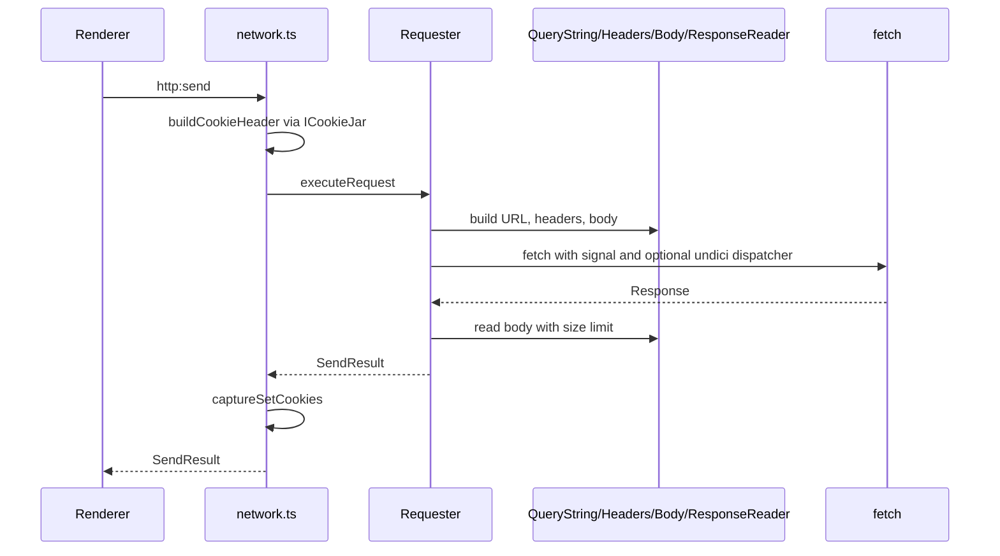

# HTTP module

Outbound HTTP for HarborClient runs in the Electron main process. This module validates URLs and headers, encodes request bodies, executes requests via `fetch` (with an optional undici dispatcher for SSL settings), enforces response size limits, and returns structured results to the renderer. The UI does not import these files directly; it sends requests through the `http:send` IPC channel handled in [`../ipc/handlers/network.ts`](../ipc/handlers/network.ts).

## Directory layout

Each responsibility is split into an interface (`I*.ts`) and a default implementation, matching the pattern used in [`../cookieJar/`](../cookieJar/).

| Role               | Files                                                                        |
| ------------------ | ---------------------------------------------------------------------------- |
| Orchestrator       | `Requester.ts`, `IRequester.ts`, `RequesterDeps` (in `Requester.ts`)         |
| Query string / URL | `QueryString.ts`, `IQueryString.ts`                                          |
| Headers            | `Headers.ts`, `IHeaders.ts` (+ `BuildHeadersResult`, `ApplyCookieResult`)    |
| Request body       | `Body.ts`, `IBody.ts` (+ `BuildMultipartResult`)                             |
| Response body      | `ResponseReader.ts`, `IResponseReader.ts` (+ `ReadResponseBodyResult`)       |
| Barrel             | `index.ts` — re-exports public types/classes and `HARD_MAX_RESPONSE_SIZE_MB` |
| Tests              | Colocated `*.test.ts` per class                                              |

Import from `#/main/http` for barrel exports, or from specific modules (e.g. `#/main/http/Requester`) when you need a single class.

## Request flow

## How `Requester` works

`Requester` is the entry point. Its constructor accepts optional `RequesterDeps` collaborators; when omitted, it defaults to `QueryString`, `Headers`, `Body`, and `ResponseReader`.

`executeRequest` runs these stages:

1. **Prepare request** — Build the URL and header map via injected collaborators; merge a cookie jar `Cookie` header when the user did not supply one.
2. **Validate early** — Return a `SendResult` error without calling `fetch` when the URL is blank or invalid, headers fail validation, or a multipart file cannot be read.
3. **Configure fetch** — Assemble `RequestInit`: body by type (JSON/text, urlencoded, multipart `FormData`, or omitted for GET/HEAD/none), a combined abort/timeout signal, `redirect: 'manual'`, and an optional insecure undici dispatcher when [`verifySsl`](../settings/generalSettings.ts) is false. When [`followRedirects`](../settings/generalSettings.ts) is true, 3xx responses with a `Location` header are followed in a loop (up to 20 hops) and recorded in `SendResult.redirects`.
4. **Execute and read** — Call `fetch` (once or per redirect hop), stream the final response through `ResponseReader` (respecting `maxResponseSizeMb` and the hard cap), and return `SendResult` with status, headers, body, timing, optional `redirects`, `setCookieHeaders`, and a snapshot of the original sent request.

## External integration

| Consumer                                                           | Role                                                                                                                                                                                         |
| ------------------------------------------------------------------ | -------------------------------------------------------------------------------------------------------------------------------------------------------------------------------------------- |
| [`../ipc/handlers/network.ts`](../ipc/handlers/network.ts)         | Primary caller: builds the cookie URL with `QueryString`, runs `Requester.executeRequest`, captures `Set-Cookie` via `ICookieJar`, and tracks `AbortController` instances for `http:cancel`. |
| [`../ipc/ipcLimits.ts`](../ipc/ipcLimits.ts)                       | Imports `HARD_MAX_RESPONSE_SIZE_MB` from `#/main/http` to align IPC body size limits with outbound HTTP.                                                                                     |
| [`../../shared/types/request.ts`](../../shared/types/request.ts)   | Defines `SendRequestInput`, `SendResult`, and related HTTP request types.                                                                                                                    |
| [`../../shared/types/settings.ts`](../../shared/types/settings.ts) | Defines `GeneralSettings` and proxy configuration types.                                                                                                                                     |
| [`../cookieJar/`](../cookieJar/)                                   | Supplies cookie headers before the request and persists response cookies afterward (outside this module).                                                                                    |

## Testing

Tests live next to their implementations (`QueryString.test.ts`, `Headers.test.ts`, etc.). Unit tests call class methods directly; `Requester.test.ts` covers orchestration with mocked `fetch`. Run the full suite with `pnpm test` (see [`TESTING.md`](../../../TESTING.md)).
