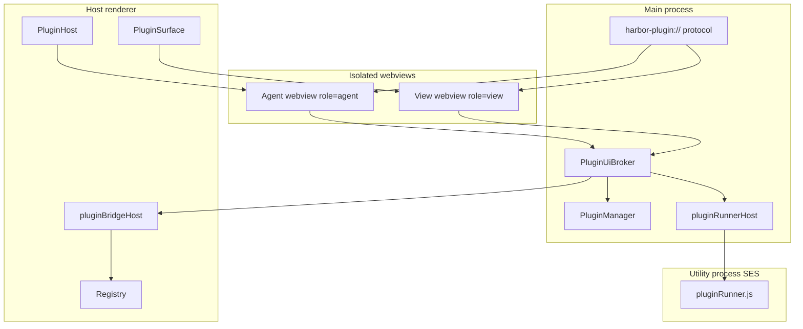
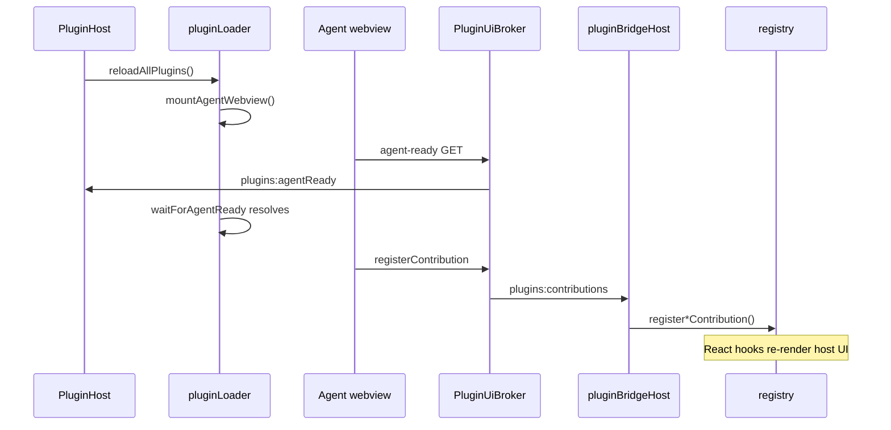

# Harbor Client plugin system

Internal architecture guide for contributors and maintainers working on the plugin
subsystem. This document explains how plugins are discovered, installed, activated,
isolated, and wired into the host UI.

For plugin **authoring** (manifest format, SDK API, publishing), see the
[harborclient-site](https://github.com/harborclient/harborclient-site) docs and
`@harborclient/sdk`. For marketplace catalog and publisher signing keys, see
[`plugins/README.md`](../../../../plugins/README.md) at the repository root.

---

## Overview

Plugins are installable packages that extend Harbor Client with UI panels, settings
sections, HTTP hooks, storage, databases, and main-process logic. Each plugin ships
a `manifest.json` and one or both entry points:

- **`renderer`** — UI bundle loaded in isolated `<webview>` documents
- **`main`** — privileged entry run in an SES-isolated utility process

The system splits work across **three runtimes**:

| Runtime         | Mechanism                                | What runs                                                      |
| --------------- | ---------------------------------------- | -------------------------------------------------------------- |
| Main process    | Node/Electron full trust                 | `PluginManager`, protocol handler, IPC, SQLite, native dialogs |
| Utility process | SES `lockdown()` + `Compartment`         | Plugin `main` entry, HTTP hooks, IPC handlers, echo server     |
| Plugin webviews | Sandbox + context isolation + strict CSP | Plugin `renderer` UI (agent + view webviews)                   |



---

## Plugin package and manifest

A plugin package is a directory (or `.hcp`/`.zip` archive) containing at minimum
`manifest.json` and the entry files it references.

### Required manifest fields

| Field                  | Description                                           |
| ---------------------- | ----------------------------------------------------- |
| `id`                   | Reverse-DNS identifier (e.g. `com.example.my-plugin`) |
| `name`, `version`      | Display name and semver                               |
| `engines.harborclient` | Minimum app version (semver constraint)               |
| `permissions`          | Capability flags enforced at runtime (see below)      |

### Optional entry points

| Field      | Purpose                                                                       |
| ---------- | ----------------------------------------------------------------------------- |
| `renderer` | Path to the UI entry (bundled and served as `harbor-plugin://{id}/bundle.js`) |
| `main`     | Path to the main-process entry (activated in the SES utility process)         |

### Declarative contributions (`contributes`)

The manifest declares **allowed UI slots**. At activation, plugin code must call
`hc.ui.register*` to populate the runtime registry. A contribution appears in the
host UI only when it is **both declared in the manifest and registered at runtime**.

Contribution buckets include:

- `settingsSections`, `sidebarPanels`, `sidebarSections`, `mainViews`
- `requestTabs`, `responseTabs`, `collectionSettingsTabs`
- `footerPanels`, `statusBarItems`, `requestToolbarActions`, `contextMenus`
- `themes`, `commands`, `menus`

Types live in [`src/shared/plugin/types.ts`](../../../shared/plugin/types.ts).
Validation uses Zod in [`src/main/plugins/manifestSchema.ts`](../../../main/plugins/manifestSchema.ts).

### Permissions

| Permission         | Grants                                                                         |
| ------------------ | ------------------------------------------------------------------------------ |
| `ui`               | Register UI contributions, show toasts, execute commands, use host integration |
| `storage`          | Plugin-scoped key-value storage in local SQLite                                |
| `database`         | Isolated SQLite database per plugin                                            |
| `filesystem:pick`  | Native file/directory pick and save dialogs (grants selected paths)            |
| `filesystem:read`  | Read files on the allowlisted paths                                            |
| `filesystem:write` | Write files on the allowlisted paths                                           |
| `http`             | Subscribe to before/after send hooks                                           |
| `ipc`              | Register main-process IPC handlers and invoke them from the renderer           |
| `server`           | Start a loopback HTTP echo server on `127.0.0.1`                               |

---

## Discovery, installation, and sources

[`PluginManager`](../../../main/plugins/PluginManager.ts) owns plugin lifecycle on disk.

### Plugin sources

| Source      | Location                                  | Notes                                  |
| ----------- | ----------------------------------------- | -------------------------------------- |
| `installed` | `userData/plugins/{id}/`                  | Installed from `.hcp` or `.zip`        |
| `git`       | Same directory + origin in dev registry   | Cloned via isomorphic-git              |
| `unpacked`  | External directory path in electron-store | Dev mode; file watchers and hot reload |

On startup, `PluginManager.discover()` scans installed directories, restores unpacked
dev paths, applies enablement from [`devRegistry.ts`](../../../main/plugins/devRegistry.ts),
seeds the filesystem allowlist, and starts hot-reload watchers for enabled unpacked
plugins.

### Enablement and session flags

- Enable/disable state persists in electron-store via `devRegistry`.
- `--disable-plugins` forces all plugins inactive for the session.
- `--plugin-dev=path` or `HARBOR_PLUGINS_DEV` loads additional unpacked paths at startup.

### Signatures

Installed and git plugins require valid publisher signatures when the author matches
a trusted publisher ([`pluginSignature.ts`](../../../main/plugins/pluginSignature.ts)).
Unpacked dev plugins skip signature checks. Unsigned third-party plugins can be
installed but show a warning before enabling.

### Settings UI

[`PluginSection`](../ui/Settings/PluginSection/index.tsx) is the admin UI for browsing
the catalog, installing, enabling, and troubleshooting plugins. It is **not** a plugin
mount point — it talks to the main process via `window.api` plugin IPC methods.

---

## Activation lifecycle

Activation is orchestrated by [`PluginHost.tsx`](PluginHost.tsx) and
[`pluginLoader.ts`](pluginLoader.ts). `PluginHost` mounts once at the app root,
registers bridge listeners, and calls `reloadAllPlugins()` on mount.

### Triggers

- App startup (`PluginHost` mount)
- `window.api.onPluginsChanged(pluginId)` — enable/disable, install, reload from Settings
- App quit — `unloadAllPlugins()` from `PluginHost` cleanup

### Per-plugin load sequence (`loadPlugin`)

1. Skip if `!plugin.enabled` or `plugin.error` (manifest/discovery failure).
2. **`unloadPlugin(plugin.id)`** — tear down any prior state.
3. **Main-only plugin** (no `manifest.renderer`):
   - If `manifest.main` exists, call `activatePluginMain`.
   - Clear runtime error, done.
4. **UI plugin** (has `manifest.renderer`):
   - Start `waitForAgentReady(pluginId)` (12 second per-attempt timeout, up to 3 attempts).
   - **`mountAgentWebview`** — create hidden agent webview at `buildPluginAgentUrl()`.
   - Wait for `plugins:agentReady` from the main-process broker.
   - Agent load chain: `shell.html` → `bootstrap.js` → SDK `viewHost` → `bundle.js` → `activate()`.
5. If `manifest.main` exists → `activatePluginMain` in the SES utility process.
6. `applyPersistedPluginTheme()` — re-apply plugin theme if selected.
7. `clearActivationError()` — clear stale Settings runtime error.

### Agent webview constraints

Agent webviews live in `#plugin-agent-webviews`, positioned off-screen. They **must
not** be placed under `display: none` — Electron may never load guest documents in
that state. See `ensureAgentContainer()` in `pluginLoader.ts`.

Each webview uses partition `persist:plugin-{pluginId}` for isolated storage.

### Unload sequence (`unloadPlugin`)

1. Remove agent webview.
2. `clearPluginContributions(pluginId)` — wipe registry entries.
3. `deactivatePluginMain(pluginId)`.
4. Re-apply persisted theme.

### Activation failure

On failure, `handleActivationFailure` auto-disables the plugin, persists the error
via `reportPluginRuntimeError`, and continues loading other plugins.



---

## PluginHost vs PluginSurface

The renderer uses a **two-webview model**: one hidden agent per plugin, and zero or
more visible surface webviews for individual UI contributions.

|         | **PluginHost**                  | **PluginSurface**                                      |
| ------- | ------------------------------- | ------------------------------------------------------ |
| Role    | Lifecycle orchestrator          | UI embedder                                            |
| Renders | `null`                          | Container `<div>` + imperative `<webview>`             |
| Webview | Hidden agent (`role=agent`)     | Visible view (`role=view`)                             |
| Count   | One agent per enabled UI plugin | One per visible contribution slot                      |
| Created | During `loadPlugin`             | When host UI mounts a contribution                     |
| URL     | `buildPluginAgentUrl(pluginId)` | `buildPluginSurfaceUrl(pluginId, contrib, kind, slot)` |

URL builders live in [`src/shared/plugin/pluginSurface.ts`](../../../shared/plugin/pluginSurface.ts).

### PluginSurface implementation notes

[`PluginSurface.tsx`](PluginSurface.tsx) creates webviews **imperatively** with
`document.createElement('webview')`. React-rendered webviews attach with an empty
`src` and are rejected by the main process `will-attach-webview` handler.

Context is pushed separately:

- On `dom-ready` and whenever props change, the host calls
  `window.api.pushPluginViewContext({ pluginId, contributionId, kind, context })`.
- The broker forwards this as a `plugin-ui:event` with channel `view.context`.

**Slots:** `content` (default), `headerActions`, `indicator` — encoded as `?slot=`
in the surface URL.

**Sizing:** Request and collection settings plugin tabs use `resizeMode="fill"`: the
webview fills the host tab area and the guest scrolls internally (`plugin-surface-fill`
in [`pluginShell.html`](../../../main/plugins/pluginShell.html)). Other surfaces use
`resizeMode="content"` (default): the guest reports height via `view.reportSize`, the
broker forwards `plugins:surfaceResize`, and `PluginSurface` sets an explicit pixel
height. Footer panels and status bar slots also use fill mode.

---

## Contribution registry and UI mount points

[`registry.ts`](registry.ts) is an in-memory store with `useSyncExternalStore`
subscription. React hooks in [`pluginHooks.ts`](pluginHooks.ts) expose sorted
snapshots to host components.

Each registration returns a `Disposable` that removes the entry. IDs are namespaced
as `plugin:{pluginId}:{contributionId}`.

| Registry bucket          | Host component                                                         | Hook                                  |
| ------------------------ | ---------------------------------------------------------------------- | ------------------------------------- |
| `settingsSections`       | [`Settings/index.tsx`](../ui/Settings/index.tsx)                       | `usePluginSettingsSections`           |
| `sidebarPanels`          | [`Sidebar/index.tsx`](../ui/Sidebar/index.tsx)                         | `usePluginSidebarPanels`              |
| `sidebarSections`        | [`Sidebar/index.tsx`](../ui/Sidebar/index.tsx)                         | `usePluginSidebarSections`            |
| `mainViews`              | [`PluginMainView`](../ui/PluginMainView/index.tsx) via Redux           | `usePluginMainViews`                  |
| `requestTabs`            | [`Request/Editor/TabContent.tsx`](../ui/Request/Editor/TabContent.tsx) | `usePluginRequestTabs`                |
| `responseTabs`           | [`Request/Response/index.tsx`](../ui/Request/Response/index.tsx)       | `usePluginResponseTabs`               |
| `collectionSettingsTabs` | [`CollectionSettings/index.tsx`](../ui/CollectionSettings/index.tsx)   | `usePluginCollectionSettingsTabs`     |
| `footerPanels`           | [`PluginFooterPanel`](../ui/Footer/PluginFooterPanel/index.tsx)        | `usePluginFooterPanels`               |
| `statusBarItems`         | [`Footer/index.tsx`](../ui/Footer/index.tsx)                           | `usePluginStatusBarItems`             |
| `requestToolbarActions`  | [`UrlBar.tsx`](../ui/Request/Editor/UrlBar.tsx)                        | `usePluginRequestToolbarActions`      |
| `menuItems`              | Native app menu (main process merge)                                   | `pluginMenuSync.ts`                   |
| `contextMenuItems`       | Sidebar row context menus                                              | `pluginContextMenuHelpers.ts`         |
| `themes`                 | General Settings appearance picker                                     | `usePluginThemes` + `themeRuntime.ts` |

Toolbar actions and context menu items invoke commands only — they do not mount
webviews. Visible plugin UI always goes through `PluginSurface`.

---

## Communication and IPC

Three distinct API surfaces connect the runtimes:

### 1. Host renderer — `window.api`

Full typed IPC contract in [`ApiPlugins`](../../../shared/types/api/plugins.ts),
implemented in [`src/preload/index.ts`](../../../preload/index.ts), handled in
[`src/main/ipc/handlers/plugins.ts`](../../../main/ipc/handlers/plugins.ts).

Used by the host renderer for plugin management, storage/database access with explicit
`pluginId`, main entry activation, filesystem operations, and pushing view context.

**Invoke channels (condensed):**

| Category       | Channels                                                                                                                                       |
| -------------- | ---------------------------------------------------------------------------------------------------------------------------------------------- |
| Lifecycle      | `plugins:list`, `plugins:setEnabled`, `plugins:reload`, `plugins:reportRuntimeError`                                                           |
| Install        | `plugins:install`, `plugins:installFromPath`, `plugins:installFromGit`, `plugins:previewFromGit`, `plugins:updateFromGit`, `plugins:uninstall` |
| Dev            | `plugins:loadUnpacked`, `plugins:loadUnpackedFromPath`, `plugins:removeUnpacked`                                                               |
| Catalog        | `plugins:catalog`, `plugins:getSources`, `plugins:setSources`, `plugins:getTeamHubSources`                                                     |
| Assets         | `plugins:readEntry`, `plugins:readAsset`                                                                                                       |
| Main runtime   | `plugins:activateMain`, `plugins:deactivateMain`, `plugins:invokeMain`                                                                         |
| Storage/DB     | `plugins:storageGet/Set`, `plugins:databaseQuery/Exec/TxBegin/TxEnd`                                                                           |
| Filesystem     | `plugins:fsPickFile`, `fsPickDirectory`, `fsSaveFile`, `fsReadFile`, `fsWriteFile`, `fsWatchFile`, `fsUnwatchFile`                             |
| UI integration | `plugins:setMenuContributions`, `plugins:pushViewContext`, `plugins:executeAgentCommand`                                                       |

**Push channels (main → host renderer):**

| Event                                        | Purpose                                                              |
| -------------------------------------------- | -------------------------------------------------------------------- |
| `plugins:changed`                            | Plugin list or state changed                                         |
| `plugins:contributions`                      | Contribution register/unregister from agent webview                  |
| `plugins:hostBridge`                         | Void host-side action (toast, load request, clear response, etc.)    |
| `plugins:hostBridgeInvoke`                   | Return-value host bridge call (HTTP send, collection metadata, etc.) |
| `plugins:hostBridgeComplete`                 | Host renderer reply completing a correlated invoke (renderer → main) |
| `plugins:surfaceResize`                      | Plugin surface webview reported guest content height                 |
| `plugins:agentReady` / `plugins:agentFailed` | Agent webview lifecycle                                              |
| `plugins:fsChanged`                          | Watched file changed                                                 |
| `menu:pluginCommand`                         | Native menu item clicked                                             |

### 2. Plugin webviews — `window.hcBridge`

Minimal preload in [`src/preload/plugin.ts`](../../../preload/plugin.ts):

- `hcBridge.invoke(op, payload)` → `plugins:uiBridge`
- `hcBridge.on(channel, listener)` ← `plugin-ui:event` fan-out

On load, preload sends `plugins:uiRegisterSession` so
[`PluginUiBroker`](../../../main/plugins/PluginUiBroker.ts) maps `webContents.id` to
`{ pluginId, role, contributionId?, kind? }`. The caller's plugin identity comes from
the registered session, not from untrusted payload fields.

The SDK view-host (`harbor-plugin://host/view-host.js`) builds the full
`PluginContext` on top of `hcBridge.invoke` operation names.

**Broker operations (`plugins:uiBridge`):**

| Operation                                          | Permission                             | Target                                                        |
| -------------------------------------------------- | -------------------------------------- | ------------------------------------------------------------- |
| `storage.get/set`                                  | `storage`                              | PluginManager                                                 |
| `database.*`                                       | `database`                             | PluginDatabaseManager                                         |
| `fs.pickFile`, `fs.pickDirectory`, `fs.saveFile`   | `filesystem:pick`                      | PluginManager via shared fs helpers (`pluginFsOperations`)    |
| `fs.readFile`, `fs.writeFile`, `fs.watchFile`      | `filesystem:read` / `filesystem:write` | PluginManager via shared fs helpers                           |
| `ipc.invoke`                                       | `ipc`                                  | SES runner (lazy-activates main if inactive)                  |
| `registerContribution/unregisterContribution`      | `ui`                                   | Host renderer via `plugins:contributions`                     |
| `ui.showToast`, `commands.execute`                 | `ui`                                   | Host renderer via `plugins:hostBridge` (void)                 |
| `commands.executeRemote`                           | `ui`                                   | Another plugin's agent webview                                |
| `host.openRequestDraft`, `host.loadRequest`, …     | `ui`                                   | Host renderer via `plugins:hostBridge` (void)                 |
| `host.sendHttpRequest`, `host.createCollection`, … | `ui`                                   | Host renderer via `plugins:hostBridgeInvoke` (returns result) |
| `themes.getActive`                                 | `ui`                                   | Main process theme getter                                     |
| `view.getContext`                                  | `ui`                                   | Cached context snapshot for a view contribution               |
| `view.reportSize`                                  | `ui`                                   | Host renderer via `plugins:surfaceResize`                     |

**Push events to webviews (`plugin-ui:event`):**

| Channel            | Purpose                                                                              |
| ------------------ | ------------------------------------------------------------------------------------ |
| `view.context`     | Serializable context snapshot for a view contribution                                |
| `themes.changed`   | Active theme metadata                                                                |
| `theme.styles`     | Theme CSS variables (preload applies to DOM)                                         |
| `commands.execute` | Run a registered command in the agent webview                                        |
| `http.afterSend`   | Completed HTTP exchange for plugins with `http` permission (agent and view webviews) |
| `fs.watch:<path>`  | Watched allowlisted file changed (view webviews using `hc.fs.watchFile`)             |

Both agent and view webviews receive `http.afterSend` when the plugin declares the
`http` permission, so footer/sidebar plugins can capture sends in the same realm that
renders their UI.

### 3. Main entry — `hc` in SES compartment

Activated via `plugins:activateMain`. Source is read from disk by
`PluginManager.resolveMainActivation()` — never from renderer-supplied payloads.

See [Main-process entry](#main-process-entry-ses-runner) below.

### Bridge host (`pluginBridgeHost.ts`)

[`pluginBridgeHost.ts`](pluginBridgeHost.ts) runs in the host renderer:

- **`onPluginsContributions`** → `applyContributionMessage` → typed registry updates
- **`onPluginsHostBridge`** → toast, command dispatch, and all `host.*` operations
  against app state (Redux thunks, etc.)

### `createPluginContext` (reference implementation)

[`createPluginContext.ts`](createPluginContext.ts) implements the SDK `PluginContext`
shape using `window.api` directly. It is **not** called during `loadPlugin` — plugin
bundles run in isolated webviews via the SDK view-host.

It remains useful for:

- Unit tests
- Host command registry (`hostCommands.ts`)
- Documenting expected plugin API behavior

---

## Custom protocol (`harbor-plugin://`)

Registered before `app.ready` in [`registerPluginProtocol.ts`](../../../main/plugins/registerPluginProtocol.ts).

### URL routing

```
harbor-plugin://host/{path}           → shared host assets
harbor-plugin://{pluginId}/{path}     → per-plugin assets
```

### Host assets (`harbor-plugin://host/*`)

| Path                               | Content                                                  |
| ---------------------------------- | -------------------------------------------------------- |
| `/styles.css`                      | App renderer CSS                                         |
| `/react.js`, `/react-dom.js`, etc. | esbuild-bundled ESM React shims (single shared instance) |
| `/view-host.js`                    | SDK view-host bootstrap                                  |
| `/bootstrap.js`                    | `pluginBootstrap.js` entry                               |

React imports in plugin bundles are rewritten to host shims so all webviews share one
React instance — avoiding "Invalid hook call" errors.

### Per-plugin assets (`harbor-plugin://{pluginId}/*`)

| Path             | Content                                               |
| ---------------- | ----------------------------------------------------- |
| `/shell.html`    | Isolated document shell (strict CSP)                  |
| `/manifest.json` | Plugin manifest from PluginManager                    |
| `/bundle.js`     | Renderer entry with React import shims                |
| `/agent-ready`   | GET → broker marks agent ready                        |
| `/agent-error`   | POST body = error message → broker marks agent failed |

All responses include `Cache-Control: no-store` to avoid stale modules in persistent
partitions.

### Webview hardening

In [`src/main/index.ts`](../../../main/index.ts) `will-attach-webview`:

- Only `harbor-plugin:` URLs are allowed
- `contextIsolation: true`, `nodeIntegration: false`, `sandbox: true`
- Preload: `preload/plugin.js`
- `setWindowOpenHandler(() => deny)`
- Protocol handler registered per partition session (`persist:plugin-{pluginId}`)

---

## Main-process entry (SES runner)

[`pluginRunnerHost.ts`](../../../main/plugins/pluginRunnerHost.ts) forks a utility
process running [`pluginRunner.ts`](../../../main/plugins/pluginRunner.ts):

1. Main entry source is transformed ESM → CJS via esbuild `transformSync`.
2. SES `lockdown()` runs in the child.
3. Plugin code evaluates in a `Compartment` with limited globals: `hc`, `console`,
   `Date`, `Math`.
4. `module.exports.activate(hc)` is called.

The `hc` API (via `createMainPluginContext`):

- `storage`, `database` — proxied to main process
- `http.onBeforeSend` / `onAfterSend` — HTTP hook registration (called from network handler)
- `ipc.handle` — channels invoked via `plugins:invokeMain`
- `server.start/stop/onRequest` — loopback echo HTTP server on `127.0.0.1`
- `scripts.createContext` — SES script contexts for plugins

Hook failures are logged and recorded as runtime errors but do not block requests.

---

## Security model

### Permission enforcement

Permissions declared in `manifest.json` are checked at:

- IPC handlers (`assertPermission` in plugin handlers)
- Broker operations (`OP_PERMISSIONS` map in `PluginUiBroker`)
- In-runner context (`createMainPluginContext.assertPermission`)

### Filesystem

[`pluginFsAllowlist.ts`](../../../main/plugins/pluginFsAllowlist.ts):

- Plugin package directory is auto-granted on discovery
- User-selected paths from pick/save dialogs are granted and persisted in SQLite
- All reads/writes resolve realpaths and reject traversal

### Signatures

Trusted publishers must sign every release. Harbor Client rejects installs when
`manifest.author` matches a trusted publisher but the signature is missing or invalid.

### Database

One SQLite file per plugin under `userData/plugin-databases/`. Serialized per-plugin
queues with transaction timeouts. `ATTACH`, `DETACH`, and `LOAD_EXTENSION` are forbidden.

### Code trust

| Source          | Trust model                                                    |
| --------------- | -------------------------------------------------------------- |
| Installed/git   | Publisher signature required                                   |
| Unpacked dev    | Signatures skipped                                             |
| Main activation | Source read from disk by main process only                     |
| Renderer bundle | Served via protocol; React redirected to host-controlled shims |

### Network

HTTP hooks run in the SES utility process. Echo servers bind to `127.0.0.1` only.

---

## Developer workflows

### Load an unpacked plugin

1. **Settings → Plugins → Load unpacked** — registers an external directory path.
2. **CLI:** `pnpm dev -- --plugin-dev=/path/to/plugin` or set `HARBOR_PLUGINS_DEV`.

Unpacked plugins are auto-enabled unless `--disable-plugins` is set. File watchers in
[`pluginHotReloadWatch.ts`](../../../main/plugins/pluginHotReloadWatch.ts) debounce
changes (300 ms) and trigger reload.

### Disable all plugins for one session

```bash
pnpm dev -- --disable-plugins
```

### Debug activation failures

- Check Settings → Plugins for persisted runtime errors
- Watch terminal output for `[plugin agent {id}]` console messages
- Agent load failures surface via `plugins:agentFailed` or timeout after up to 3 activation attempts

---

## Key files map

```
src/main/plugins/
  PluginManager.ts          Discovery, install, enablement, permissions, FS allowlist
  PluginUiBroker.ts         Webview ↔ main ↔ host bridge router
  registerPluginProtocol.ts harbor-plugin:// asset serving
  pluginRunnerHost.ts       Utility process lifecycle
  pluginRunner.ts           SES compartment + hc API
  manifestSchema.ts         Zod manifest validation
  pluginSignature.ts        Publisher signature verification
  devRegistry.ts            Enablement + unpacked path persistence
  pluginFsAllowlist.ts      Filesystem grant enforcement
  pluginHotReloadWatch.ts   Unpacked plugin file watchers
  PluginDatabaseManager.ts  Per-plugin SQLite
  pluginShell.html          Isolated webview document shell
  pluginBootstrap.js        View-host bootstrap entry

src/renderer/src/plugins/
  PluginHost.tsx            Lifecycle orchestrator (mounts at app root)
  pluginLoader.ts           Agent webview mount, load/unload/reload
  PluginSurface.tsx         Visible contribution webview embedder
  pluginBridgeHost.ts       Contribution + host bridge event handlers
  registry.ts               In-memory contribution store
  pluginHooks.ts            React hooks for registry subscriptions
  pluginMenuSync.ts         Push menu items to main process
  createPluginContext.ts    Host-side PluginContext reference impl
  themeRuntime.ts           Inject plugin theme CSS into host document
  hostCommands.ts           Built-in harborclient:* commands
  hostRequestCommands.ts    host.* request integration
  hostEnvironmentCommands.ts host.* environment integration

src/shared/plugin/
  types.ts                  PluginManifest, PluginInfo, registry types
  pluginSurface.ts          URL builders for agent/view webviews
  catalog.ts                Marketplace catalog schema
  databaseTypes.ts          PluginDatabase types + SDK augmentation

src/preload/
  index.ts                  window.api plugin IPC wrappers
  plugin.ts                 window.hcBridge for isolated webviews

src/main/ipc/handlers/plugins.ts   Typed IPC handler registration

plugins/                    Marketplace catalog + signing keys (see plugins/README.md)
```

---

## Related documentation

| Resource                                                               | Audience       | Content                                       |
| ---------------------------------------------------------------------- | -------------- | --------------------------------------------- |
| [`plugins/README.md`](../../../../plugins/README.md)                   | Maintainers    | Catalog, signing keys, publisher workflow     |
| [harborclient-site](https://github.com/harborclient/harborclient-site) | Plugin authors | User-facing docs, marketplace metadata        |
| `@harborclient/sdk`                                                    | Plugin authors | `PluginContext`, view-host, signing utilities |
| [`CONTRIBUTING.md`](../../../../CONTRIBUTING.md)                       | Contributors   | Project layout, IPC contract, code style      |
